# Bonus Domain

Document code: DOMAIN-BONUS-001
Task: EPIC-300 / DOMAIN-003
Version: 0.1
Status: Draft
Project: Soft ICE Platform / Utimoshi
Owner: Product Owner Alexander Ilyin
Created: 2026-07-06
Last updated: 2026-07-06
Scope: Documentation only

Related documents:

- `AGENTS.md`
- `PROJECT_MEMORY.md`
- `docs/architecture/ARCHITECTURE_PRINCIPLES.md`
- `docs/architecture/DDD_LITE_ARCHITECTURE.md`
- `docs/architecture/PROJECT_DECISIONS.md`
- `docs/architecture/BONUS_ENGINE.md`
- `docs/architecture/DISCOUNT_ENGINE.md`
- `docs/architecture/PRICING_ENGINE.md`
- `docs/architecture/CHECKOUT.md`
- `docs/architecture/PAYMENT_ENGINE.md`
- `docs/architecture/WALLET.md`
- `docs/architecture/LEDGER.md`
- `docs/domain/CUSTOMER_DOMAIN.md`
- `docs/domain/CLUB_ACCOUNT.md`
- `docs/domain/CONSENT_MODEL.md`
- `docs/api/EVENT_API.md`
- `docs/tasks/FINANCE-005_BONUS_ENGINE.md`
- `docs/tasks/TASK_INDEX.md`

---

# 1. Purpose

Bonus Domain describes the customer bonus system for Soft ICE Platform and Club Timofey.

The domain exists so the platform can:

- create and maintain a customer Bonus Account;
- accrue bonus rights from purchases, referrals, birthdays, trusted customer rules, seasonal campaigns and approved manual adjustments;
- keep immutable Bonus Transactions;
- activate, reserve, redeem, release, expire, cancel and reverse bonus rights;
- run expiration and burn policies safely;
- request notification scheduling for accrual, redemption and upcoming expiration without delivering messages directly;
- support CRM, support, reporting, analytics and future Promotion Runtime through clear contracts;
- preserve the financial boundary that bonuses are not money.

Core rule:

```text
1 bonus = the right to receive a discount with a nominal value of 1 RUB according to platform rules.
```

Non-negotiable boundaries:

```text
Bonus is not money.
Bonus is not Wallet balance.
Bonus is not Club Account balance.
Bonus is not a bank account, deposit, cashback cash or debt.
Bonus cannot be withdrawn, transferred as cash or used outside approved discount rules.
Bonus redemption creates a discount effect before payment.
```

This document is documentation-only and introduces no application code.

---

# 2. DDD Lite Boundary

Bonus Domain is a DDD Lite bounded context connected to Customer Platform, Finance Platform, Checkout, Discount and future Promotion Platform.

Architecture position:

```text
Customer / Club / Order / Promotion facts
->
Bonus Domain
->
Bonus Account, Bonus Transactions and Bonus Projection
->
Checkout / Discount / Order
->
Payment, Ledger and Wallet remain separate
->
Notification / CRM / Reporting / Analytics
```

Bonus Domain owns:

- Bonus Account identity and lifecycle;
- bonus right lifecycle;
- bonus transaction journal;
- bonus projection by customer;
- bonus batch and expiration metadata;
- bonus reservation state;
- bonus redemption state;
- referral bonus rules and reward state;
- birthday bonus rules and reward state;
- trusted customer bonus rules and reward state;
- seasonal bonus rules and reward state;
- manual adjustment model;
- expiration policy evaluation;
- Burn Scheduler policy for scheduled reduction of usable bonus rights;
- Notification Scheduler trigger policy for bonus-related messages;
- audit metadata for bonus operations;
- bonus domain events.

Bonus Domain does not own:

- Customer identity or profile data;
- Club Account prepaid balance;
- Wallet cash balance;
- Ledger as the financial source of truth;
- product catalog, recipe or media selection;
- product price calculation;
- discount stacking and final payable amount;
- external payment provider interaction;
- Order lifecycle and machine fulfillment;
- notification delivery, templates or channel credentials;
- CRM screens and operator permissions;
- Promotion campaign authoring UI;
- API authentication or authorization.

Financial source-of-truth rule:

```text
Ledger is the source of truth for financial facts.
Wallet and Club Account are monetary projections or customer-facing prepaid models.
Bonus Domain is the source of truth for non-monetary discount rights.
```

UI must never calculate, mutate, reserve, redeem, expire or merge bonuses locally.

---

# 3. Ubiquitous Language

| Term | Meaning |
|---|---|
| Bonus | Non-monetary right to receive a discount with a nominal value of 1 RUB according to platform rules. |
| Bonus Account | Customer-linked account that stores the current bonus projection and lifecycle state. |
| Bonus Account ID | Stable identifier stored as `bonus_account_id`. |
| Bonus Transaction | Append-only record of an accepted bonus operation. |
| Bonus Batch | A lot of bonus rights created by one accrual source and governed by one rule version and expiration policy. |
| Active Bonus | Bonus rights available for reservation or redemption. |
| Pending Bonus | Bonus rights accrued but not yet available. |
| Reserved Bonus | Bonus rights temporarily held for checkout or another approved flow. |
| Redeemed Bonus | Bonus rights consumed as an accepted discount effect. |
| Expired Bonus | Bonus rights no longer usable after expiration policy. |
| Cancelled Bonus | Bonus rights invalidated before redemption because the source or rule became invalid. |
| Reversed Bonus | Compensating operation for a previous accrual or redemption. |
| Burn | Reduction of usable bonus rights by redemption, expiration, cancellation or approved policy. |
| Burn Scheduler | Scheduled worker that applies due burn policies such as expiration and approved automated cancellation. |
| Notification Scheduler | Scheduled worker that detects bonus notification candidates and requests Notification Runtime. |
| Referral Bonus | Bonus rights accrued after an approved referral relationship qualifies. |
| Birthday Bonus | Bonus rights accrued during an approved birthday reward window. |
| Trusted Customer Bonus | Bonus rights accrued from an approved trusted customer rule. |
| Seasonal Bonus | Bonus rights accrued from a time-bound seasonal campaign rule. |
| Manual Adjustment | Operator-approved bonus credit, debit, extension, cancellation or reversal with audit. |
| Bonus Rule | Versioned policy that defines eligibility, amount, activation, expiration and limits. |
| Bonus Projection | Current customer-facing summary built from Bonus Transactions. |
| Bonus Audit Trail | Operator/system-visible immutable audit metadata for sensitive actions. |

Customer-facing language must describe bonuses as "bonuses for a discount" or "bonus discount rights". It must not describe bonuses as cash, wallet funds, prepaid balance or money returned to the customer.

---

# 4. Domain Model Overview

Bonus Domain uses these primary model objects:

| Model | Type | Purpose |
|---|---|---|
| `BonusAccount` | Aggregate | Customer-level account and projection state. |
| `BonusTransaction` | Journal entry | Immutable record of accepted bonus operation. |
| `BonusBatch` | Entity / read model | Accrued lot with source, rule, activation and expiration metadata. |
| `BonusReservation` | Entity | Temporary hold for checkout or another approved redemption flow. |
| `BonusRule` | Policy | Versioned rule for source eligibility, amount, caps and expiration. |
| `BonusSchedulerRun` | Operational record | Idempotent execution record for Burn Scheduler or Notification Scheduler. |
| `BonusAuditRecord` | Audit record | Sensitive action metadata with actor, reason and correlation IDs. |

Model first rule:

```text
Bonus Account state is derived from Bonus Transactions and policy metadata.
Bonus Transactions are append-only.
Corrections are compensating operations.
```

---

# 5. Bonus Account

The main aggregate is `BonusAccount`.

Minimal model:

```json
{
  "bonus_account_id": "bonus_account_01JZ0000000000000000000000",
  "customer_id": "customer_01JZ0000000000000000000000",
  "status": "active",
  "bonus_unit": "bonus",
  "active_bonus": 50,
  "reserved_bonus": 0,
  "pending_bonus": 10,
  "expiring_soon_bonus": 20,
  "lifetime_accrued_bonus": 100,
  "lifetime_redeemed_bonus": 30,
  "lifetime_expired_bonus": 20,
  "lifetime_cancelled_bonus": 0,
  "projection_version": 1,
  "last_transaction_id": "bonus_tx_01JZ0000000000000000000000",
  "created_at": "2026-07-06T00:00:00Z",
  "updated_at": "2026-07-06T00:00:00Z"
}
```

Account invariants:

- one active Bonus Account belongs to one `customer_id`;
- a customer may have at most one active Bonus Account for the default bonus program unless a future multi-program policy is approved;
- bonus unit is `bonus`, not `RUB`;
- all projection counters are non-negative;
- `active_bonus`, `reserved_bonus` and `pending_bonus` are separate;
- `lifetime_*` counters are reporting counters and must not be edited manually;
- Bonus Account cannot create Wallet or Club Account balance;
- Bonus Account cannot be used as payment method;
- account state is rebuilt from accepted Bonus Transactions and rule metadata;
- account history is append-only.

---

# 6. Bonus Account Lifecycle

Bonus Account lifecycle:

```text
not_created
->
pending_activation
->
active
|-> frozen -> active
|-> closed -> archived
```

Lifecycle states:

| State | Meaning | Allowed operations |
|---|---|---|
| `not_created` | No Bonus Account exists for the customer. | Create account. |
| `pending_activation` | Account exists but required customer, consent or club prerequisites are incomplete. | Activate or cancel activation. |
| `active` | Account can accrue, activate, reserve, redeem, release, expire and receive scheduler checks. | Normal operations. |
| `frozen` | Redemption and reservation are blocked during review. | Reads, accrual by policy, expiration by policy, cancellation, reversal, audit. |
| `closed` | Account is read-only for new customer operations. | Read history, reporting, audit, approved correction. |
| `archived` | Account retained for history and compliance. | Audit reads only. |

Lifecycle rules:

- Bonus Account requires a valid `customer_id`;
- account creation does not grant bonus rights by itself;
- joining Club Timofey may create or activate a Bonus Account only through an approved rule;
- frozen account does not erase bonus history;
- expiration may continue while frozen when the active rule says so;
- closing keeps bonus history and audit;
- reactivation from `closed` requires a future Product Owner-approved policy.

---

# 7. Bonus Transaction

`BonusTransaction` is the append-only journal entry for all accepted bonus operations.

Minimal model:

```json
{
  "bonus_transaction_id": "bonus_tx_01JZ0000000000000000000000",
  "bonus_account_id": "bonus_account_01JZ0000000000000000000000",
  "customer_id": "customer_01JZ0000000000000000000000",
  "transaction_type": "accrual",
  "amount": 10,
  "bonus_unit": "bonus",
  "source_type": "purchase",
  "source_id": "order_01JZ0000000000000000000000",
  "rule_id": "bonus_rule_purchase_default",
  "rule_version": 1,
  "batch_id": "bonus_batch_01JZ0000000000000000000000",
  "reservation_id": null,
  "related_transaction_id": null,
  "reason_code": "purchase_completed",
  "actor_type": "system",
  "actor_id": "runtime_order",
  "idempotency_key": "order_01JZ_bonus_purchase_v1",
  "correlation_id": "corr_01JZ0000000000000000000000",
  "created_at": "2026-07-06T00:00:00Z",
  "metadata": {}
}
```

Transaction types:

| Type | Projection effect |
|---|---|
| `account_created` | Creates Bonus Account without bonus amount. |
| `accrual_pending` | Adds to `pending_bonus`. |
| `accrual_activated` | Moves pending or new amount to `active_bonus`. |
| `reservation_created` | Moves active to reserved. |
| `reservation_released` | Moves reserved to active. |
| `redemption_captured` | Moves reserved to redeemed lifetime counter. |
| `expiration_burned` | Moves active or policy-eligible amount to expired lifetime counter. |
| `bonus_cancelled` | Moves pending or active amount to cancelled lifetime counter. |
| `bonus_reversed` | Compensates a previous accrual, redemption or cancellation. |
| `manual_credit` | Adds active or pending bonus by approved operator action. |
| `manual_debit` | Removes active bonus by approved operator action. |
| `expiration_extended` | Changes future expiration policy through compensating metadata, not by editing original transaction. |
| `account_frozen` | Changes account status without amount. |
| `account_restored` | Changes account status without amount. |
| `account_closed` | Changes account status without amount. |

Transaction rules:

- transactions are immutable after creation;
- transaction amount is an integer number of bonus units;
- transaction amount is not currency;
- every side-effect transaction requires idempotency;
- every transaction references a source, rule and reason when meaningful;
- manual transactions require actor, role, reason and audit metadata;
- reversal references the original transaction;
- rejected commands do not create successful transactions, but sensitive rejections may create audit records.

---

# 8. Bonus Batch

A `BonusBatch` is a lot of bonus rights created by one source under one rule version.

Batch model:

```json
{
  "bonus_batch_id": "bonus_batch_01JZ0000000000000000000000",
  "bonus_account_id": "bonus_account_01JZ0000000000000000000000",
  "customer_id": "customer_01JZ0000000000000000000000",
  "source_type": "referral",
  "source_id": "referral_01JZ0000000000000000000000",
  "rule_id": "bonus_rule_referral_default",
  "rule_version": 1,
  "initial_amount": 50,
  "active_amount": 50,
  "reserved_amount": 0,
  "redeemed_amount": 0,
  "expired_amount": 0,
  "cancelled_amount": 0,
  "status": "active",
  "activated_at": "2026-07-06T00:00:00Z",
  "expires_at": "2026-10-04T00:00:00Z",
  "created_at": "2026-07-06T00:00:00Z"
}
```

Batch rules:

- every accrual creates one or more batches;
- every batch keeps source, rule ID and rule version;
- expiration is evaluated by batch;
- redemption consumes nearest-expiring eligible active batches first unless rule version says otherwise;
- partial reservation and partial redemption are allowed;
- batch counters must sum to `initial_amount`;
- batch edits are forbidden; changes are transactions or derived projection updates;
- batches with no remaining active or reserved amount become terminal for customer use.

---

# 9. Bonus Projection

Bonus Projection is the customer-facing current summary.

Projection fields:

| Field | Meaning |
|---|---|
| `active_bonus` | Usable bonus rights available for reservation. |
| `reserved_bonus` | Temporarily held bonus rights. |
| `pending_bonus` | Accrued but not yet active rights. |
| `expiring_soon_bonus` | Active rights whose expiration is inside a configured reminder window. |
| `lifetime_accrued_bonus` | Total bonus rights ever accrued. |
| `lifetime_redeemed_bonus` | Total bonus rights consumed as discount. |
| `lifetime_expired_bonus` | Total bonus rights expired by policy. |
| `lifetime_cancelled_bonus` | Total bonus rights cancelled or invalidated. |
| `projection_version` | Monotonic projection version. |
| `last_transaction_id` | Last transaction applied to projection. |

Projection rules:

- projection can be rebuilt from Bonus Transactions and Batch state;
- projection must not be built from UI state;
- projection must not add Wallet or Club Account balances;
- projection lag must be detectable;
- duplicate transaction events must be idempotent;
- replay must not repeat payment, notification or machine side effects.

---

# 10. Bonus Rules and Policies

Bonus behavior is controlled by versioned `BonusRule` records.

Rule model:

```json
{
  "rule_id": "bonus_rule_birthday_2026",
  "rule_version": 1,
  "source_type": "birthday",
  "status": "active",
  "amount": 50,
  "activation": "immediate",
  "expires_after_days": 14,
  "frequency_limit": {
    "scope": "customer",
    "period": "birthday_window",
    "max_count": 1
  },
  "eligibility": {
    "requires_customer_active": true,
    "requires_marketing_consent": false,
    "requires_loyalty_terms": true
  },
  "starts_at": "2026-01-01T00:00:00Z",
  "ends_at": "2026-12-31T23:59:59Z"
}
```

Rule principles:

- rules are identified by stable `rule_id` and `rule_version`;
- rule edits create a new version;
- historical batches keep the rule version that created them;
- rule status controls future operations, not historical meaning;
- amount, activation, expiration and limits must be explicit;
- every source type must declare idempotency scope;
- rules may be configured later through Promotion Runtime, but Bonus Domain executes bonus rights lifecycle.

---

# 11. Accrual Sources

Supported source types:

| Source | Purpose | Ownership boundary |
|---|---|---|
| `purchase` | Reward confirmed orders. | Order/Payment facts qualify; Bonus executes accrual. |
| `referral` | Reward inviter or invited customer after qualification. | Customer owns relationship; Bonus executes reward. |
| `birthday` | Reward eligible customer during birthday window. | Customer owns birth date and consent; Bonus executes rule. |
| `trusted_customer` | Reward customer with approved trust status. | Customer/CRM owns trust status; Bonus executes reward. |
| `seasonal` | Reward customer from time-bound campaign. | Promotion owns campaign; Bonus executes reward. |
| `manual_adjustment` | Operator credit/debit/extension/cancellation. | CRM/support requests command; Bonus records and audits. |
| `service_recovery` | Support goodwill after incident. | Support reason required; Bonus executes reward. |
| `partner_program` | Future partner reward. | Partner adapter qualifies; Bonus executes reward. |

Accrual requirements:

- stable source ID;
- rule ID and rule version;
- idempotency key;
- customer ID;
- amount in bonus units;
- activation policy;
- expiration policy;
- actor or system source;
- correlation ID;
- audit metadata when source is manual, support or partner.

---

# 12. Referral Bonus

Referral Bonus rewards an approved referral relationship after qualification.

Referral flow ownership:

```text
Customer Domain owns referral relationship.
Promotion Domain may own referral campaign definition in the future.
Bonus Domain owns reward accrual, activation, expiration and history.
```

Referral bonus model:

```json
{
  "referral_bonus_id": "ref_bonus_01JZ0000000000000000000000",
  "referral_id": "referral_01JZ0000000000000000000000",
  "inviter_customer_id": "customer_inviter",
  "invited_customer_id": "customer_invited",
  "reward_side": "inviter",
  "rule_id": "bonus_rule_referral_default",
  "rule_version": 1,
  "status": "pending",
  "qualifying_event_id": "order_01JZ0000000000000000000000",
  "bonus_transaction_id": null
}
```

Referral rules:

- self-referral is forbidden;
- one referred customer can qualify one inviter per program unless a future rule says otherwise;
- duplicate rewards for the same qualifying event are forbidden;
- qualification must come from accepted Customer, Order or Promotion facts, not client-side input alone;
- reward may remain `pending` until first paid order, delivery completion or another approved condition;
- fraud review can freeze or cancel pending referral reward;
- referral loops, repeated device patterns and suspicious chains require review where legally allowed;
- referral bonus amount and eligibility require Product Owner-approved rule version before implementation.

---

# 13. Birthday Bonus

Birthday Bonus rewards an eligible customer during an approved birthday campaign window.

Birthday rules:

- birth date is personal data and belongs to Customer Domain;
- Birthday Bonus requires an approved legal basis and consent/policy alignment;
- rule must define timezone, start window, end window, amount and expiration;
- default production amount is not defined by this document and requires Product Owner approval;
- customer may receive at most one Birthday Bonus per rule period unless rule version explicitly allows otherwise;
- missing or unverified birth date means no automatic accrual;
- changing birth date after reward issuance must not silently issue duplicate bonus;
- birthday bonus normally uses short expiration to avoid unlimited liability of discount rights;
- Notification Runtime owns greeting delivery and templates.

Birthday state:

```text
eligible_window_detected
->
pending_accrual
->
accrued
->
active
|-> redeemed
|-> expired
|-> cancelled
```

---

# 14. Trusted Customer Bonus

Trusted Customer Bonus rewards a customer based on approved trust status or support/VIP policy.

Trusted customer boundary:

```text
Customer Domain owns trusted status.
Discount Engine may apply trusted customer discounts.
Bonus Domain may accrue trusted customer bonus rights only by approved rule.
```

Rules:

- trusted status is not an authorization role;
- trusted status does not bypass checkout, payment, fraud or consent rules;
- Bonus Domain must not infer trust from UI labels;
- accrual requires `trusted_status_id`, rule ID and rule version;
- operator-granted trusted bonus requires actor, permission and reason;
- rewards may be one-time, periodic or event-based only when rule version states it;
- revoked trust status does not edit historical bonus transactions;
- future trust scoring criteria require Product Owner approval.

---

# 15. Seasonal Bonus

Seasonal Bonus rewards customers through a time-bound campaign.

Seasonal campaign examples:

- opening week reward;
- summer dessert campaign;
- machine-location campaign;
- holiday campaign;
- win-back campaign;
- partner seasonal campaign.

Seasonal rules:

- campaign uses `campaign_id`, `rule_id` and `rule_version`;
- eligibility window uses server time and explicit timezone policy;
- campaign budget and per-customer cap must be explicit when configured;
- campaign edits create new rule versions;
- historical bonus transactions keep original campaign meaning;
- seasonal bonuses may be pending until the qualifying event is confirmed;
- future Promotion Runtime owns campaign authoring and budget workflow;
- Bonus Domain executes approved accrual and lifecycle operations.

---

# 16. Manual Adjustment

Manual Adjustment is an operator or support action that changes bonus rights through an approved Bonus command.

Allowed adjustment types:

| Type | Meaning |
|---|---|
| `manual_credit` | Add bonus rights. |
| `manual_debit` | Remove active bonus rights. |
| `manual_cancel` | Cancel pending or active bonus rights. |
| `manual_reverse` | Compensate a previous operation. |
| `manual_extend_expiration` | Extend expiration through approved policy. |
| `manual_freeze_account` | Freeze account for review. |
| `manual_restore_account` | Restore frozen account. |

Manual adjustment rules:

- CRM or support UI must call approved Bonus commands;
- direct database edits are forbidden;
- every manual adjustment requires operator ID, role, reason and correlation ID;
- high-risk actions should require future approval workflow or dual control;
- manual debit cannot make active bonus negative;
- manual credit must create a batch with source `manual_adjustment`;
- manual expiration extension does not edit original accrual transaction;
- manual correction uses compensating transactions;
- customer-facing history may show a simplified reason, while audit keeps operational metadata.

---

# 17. Expiration

Expiration is a policy transition that makes bonus rights no longer usable after `expires_at`.

Expiration rules:

- every batch must have `expires_at` or an explicit non-expiring policy approved by Product Owner;
- expiration is evaluated by batch, not by customer total;
- expired bonuses cannot be reserved, redeemed or restored from UI state;
- expiration is not a payment, refund, revenue event or Wallet operation;
- expiration creates `expiration_burned` transactions;
- expiration may continue for frozen accounts when the rule says so;
- manual extension requires approved command and audit;
- upcoming expiration may trigger Notification Scheduler.

Expiration policy example:

```json
{
  "policy_id": "bonus_expiration_default_2026",
  "source_type": "purchase",
  "expires_after_days": 90,
  "timezone": "UTC",
  "upcoming_expiration_notice_days": [14, 3],
  "redeem_order": "nearest_expiration_first"
}
```

---

# 18. Burn Scheduler

Burn Scheduler is the scheduled process that applies due bonus burn policies.

In this domain, "burn" means that bonus rights become no longer usable or are consumed:

- redemption burn: customer-selected bonus rights are consumed during checkout;
- expiration burn: active rights expire after policy date;
- cancellation burn: pending or active rights are invalidated by approved rule;
- reversal burn: compensating operation removes previously granted or restored rights.

Burn Scheduler only handles scheduled or policy-due burns. Customer checkout redemption is not performed by Burn Scheduler.

Scheduler responsibilities:

- find due batches for expiration;
- find due pending rewards that should be cancelled by source policy;
- find due reservation timeouts where owning reservation policy requires release or expiry;
- create idempotent scheduler run records;
- lock or claim work safely;
- apply transactions through Bonus Domain commands;
- publish events after accepted transactions;
- record audit and telemetry;
- stop without partial hidden mutation when the run fails.

Scheduler run model:

```json
{
  "scheduler_run_id": "bonus_burn_run_01JZ0000000000000000000000",
  "scheduler_type": "burn",
  "policy_id": "bonus_expiration_default_2026",
  "status": "completed",
  "started_at": "2026-07-06T00:00:00Z",
  "completed_at": "2026-07-06T00:00:05Z",
  "cursor": "bonus_batch_01JZ0000000000000000000000",
  "processed_count": 100,
  "created_transaction_count": 80,
  "idempotency_key": "burn_2026-07-06_policy_default"
}
```

Burn Scheduler rules:

- server time is authoritative;
- each due batch is processed once per due policy;
- repeated scheduler runs must be idempotent;
- scheduler must not send notifications directly;
- scheduler must not create Wallet, Club Account or Ledger money;
- scheduler must not redeem bonuses for a checkout;
- ambiguous batch or reservation state enters manual review instead of guessing;
- replay or redrive must not duplicate expiration or cancellation transactions.

---

# 19. Notification Scheduler

Notification Scheduler detects bonus notification candidates and requests Notification Runtime.

Notification Scheduler does not deliver messages.

Notification candidates:

- bonus accrued;
- pending bonus activated;
- bonus redeemed;
- bonus reservation released when customer needs to know;
- upcoming expiration reminder;
- expiration completed;
- referral reward issued;
- birthday bonus issued;
- manual support adjustment visible to customer.

Notification scheduler model:

```json
{
  "scheduler_run_id": "bonus_notification_run_01JZ0000000000000000000000",
  "scheduler_type": "notification",
  "trigger_type": "upcoming_expiration",
  "status": "completed",
  "customer_id": "customer_01JZ0000000000000000000000",
  "bonus_account_id": "bonus_account_01JZ0000000000000000000000",
  "candidate_count": 1,
  "requested_count": 1,
  "suppressed_count": 0,
  "idempotency_key": "bonus_expiring_soon_customer_01JZ_2026-07-06"
}
```

Notification rules:

- Notification Runtime owns templates, delivery, throttling, channels and provider callbacks;
- Bonus Domain may request or recommend notifications through events or commands;
- marketing notifications require marketing consent when applicable;
- transactional or account-related notifications must remain separate from marketing;
- no notification may describe bonuses as cash;
- failed delivery does not rollback bonus operations;
- replay must not resend messages unless explicitly run in a replay-safe mode;
- suppression by consent, preference, duplicate window or throttling should be observable for support.

---

# 20. Reservation and Redemption

Reservation temporarily holds active bonus rights for checkout.

Reservation model:

```json
{
  "bonus_reservation_id": "bonus_reservation_01JZ0000000000000000000000",
  "bonus_account_id": "bonus_account_01JZ0000000000000000000000",
  "customer_id": "customer_01JZ0000000000000000000000",
  "checkout_intent_id": "checkout_01JZ0000000000000000000000",
  "order_id": "order_01JZ0000000000000000000000",
  "discount_result_id": "discount_result_01JZ0000000000000000000000",
  "amount": 20,
  "status": "active",
  "expires_at": "2026-07-06T00:15:00Z",
  "created_at": "2026-07-06T00:00:00Z"
}
```

Reservation lifecycle:

```text
requested
->
active
|-> redeemed
|-> released
|-> expired
|-> cancelled
```

Reservation rules:

- only active eligible bonus rights can be reserved;
- reservation amount cannot exceed active eligible bonus;
- reservation amount cannot exceed Discount/Pricing allowed bonus cap;
- reservation must reference checkout, order or approved flow;
- reservation must expire or be released if checkout fails;
- reserved bonuses cannot be used by another checkout;
- reservation is not money and not Wallet reserve;
- duplicate reservation commands must return existing result when payload matches.

Redemption rules:

- redemption consumes reserved bonus rights as accepted discount effect;
- redemption happens after payment/order success policy says the checkout is accepted;
- redemption cannot make payable amount negative;
- redemption cannot create cash change or Wallet balance;
- redemption is idempotent by reservation/order/payment correlation;
- refund or cancellation may trigger Bonus reversal according to rule and refund policy.

---

# 21. Cancellation and Reversal

Cancellation invalidates bonus rights before redemption.

Reversal compensates a previously accepted operation.

Cancellation reasons:

- source order was cancelled before reward qualification;
- source payment failed;
- referral relationship was invalid;
- campaign rule was misconfigured and approved correction is required;
- fraud review confirmed abuse;
- duplicate accrual was detected;
- operator adjustment with approved reason;
- customer account or bonus account closed according to policy.

Reversal scenarios:

- refunded order reverses purchase reward according to rule;
- manual credit was issued to wrong customer;
- redeemed bonus needs compensation after order correction;
- duplicate provider or event fact created a duplicate accrual despite idempotency controls.

Rules:

- cancellation and reversal never delete original transactions;
- redeemed bonuses require reversal policy, not direct mutation;
- reversal references original transaction ID;
- reversal must preserve customer-visible and operator-visible explanation;
- financial refund belongs to Payment/Order/Wallet/Ledger, not Bonus Domain;
- Bonus reversal may affect future bonus availability but does not perform payment refund.

---

# 22. Audit

Bonus Domain keeps audit metadata for sensitive operations.

Audit record model:

```json
{
  "audit_id": "bonus_audit_01JZ0000000000000000000000",
  "bonus_account_id": "bonus_account_01JZ0000000000000000000000",
  "customer_id": "customer_01JZ0000000000000000000000",
  "action": "manual_credit",
  "actor_type": "operator",
  "actor_id": "operator_01JZ0000000000000000000000",
  "actor_role": "crm_support",
  "reason_code": "service_recovery",
  "reason_text": "Approved customer support compensation",
  "source_channel": "crm",
  "correlation_id": "corr_01JZ0000000000000000000000",
  "created_at": "2026-07-06T00:00:00Z"
}
```

Audited actions:

- manual credit, debit, cancellation, reversal and expiration extension;
- account freeze, restore, close and archive;
- scheduler redrive;
- dead-letter redrive affecting bonus state;
- fraud review decisions;
- rule approval and rule version activation;
- CRM support access to sensitive bonus history;
- rejected sensitive commands.

Audit rules:

- actor, role, reason and correlation ID are required for operator actions;
- audit records are immutable;
- audit records must not contain raw payment credentials, tokens or secrets;
- customer-visible history is a safe subset of audit;
- audit redaction must preserve legal and operational traceability.

---

# 23. State Machines

## 23.1 Bonus Account State Machine

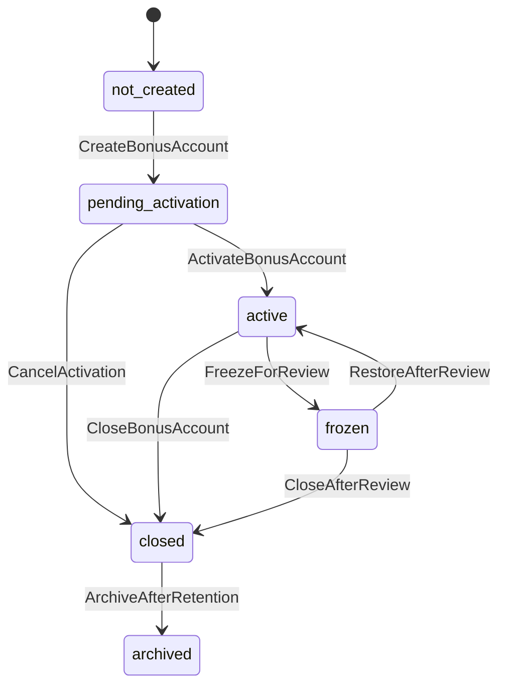

## 23.2 Bonus Batch State Machine

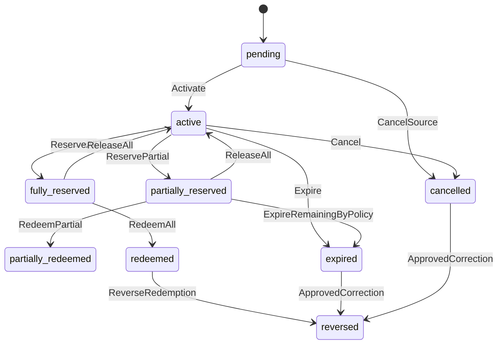

## 23.3 Bonus Reservation State Machine

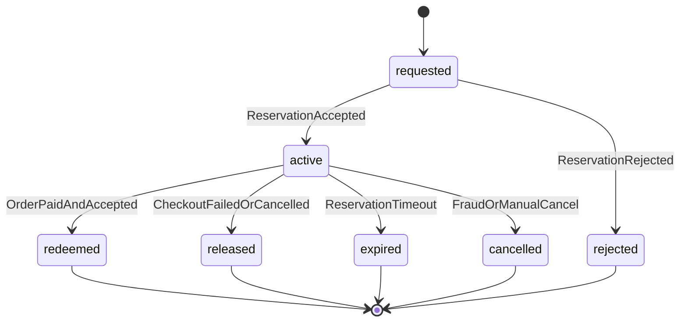

---

# 24. Sequence Diagrams

## 24.1 Purchase Bonus Accrual

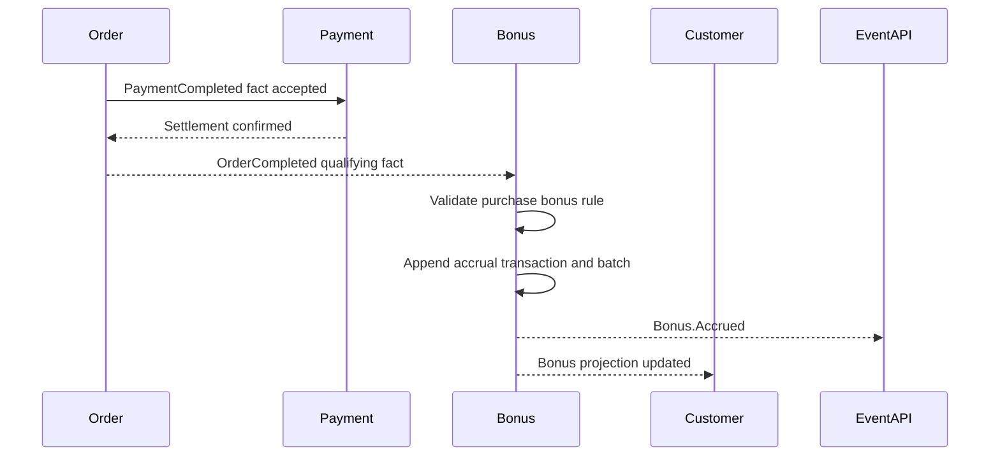

## 24.2 Checkout Reservation and Redemption

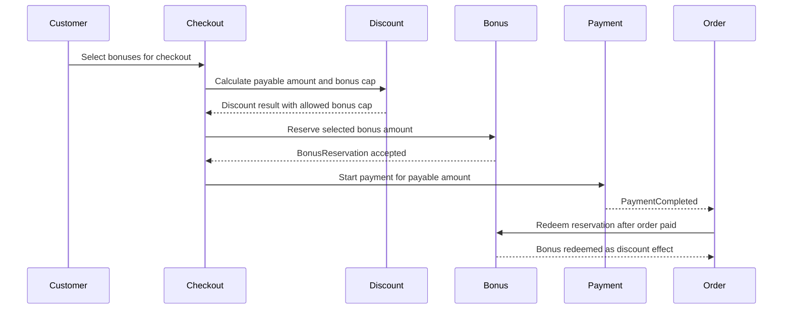

## 24.3 Reservation Release After Payment Failure

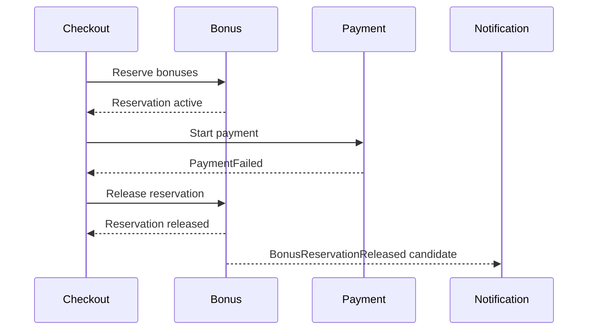

## 24.4 Expiration Burn Scheduler

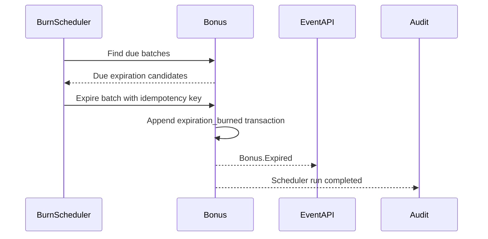

## 24.5 Upcoming Expiration Notification

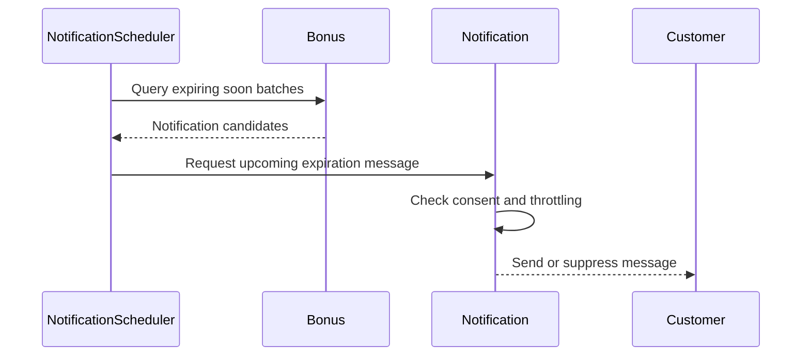

## 24.6 Referral Bonus Qualification

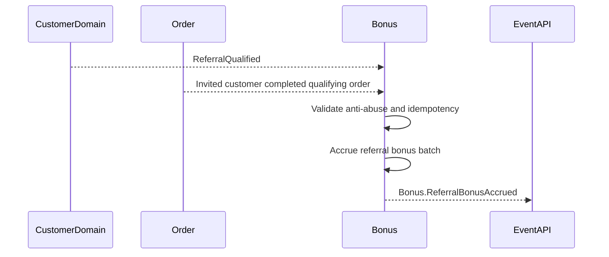

## 24.7 Birthday Bonus

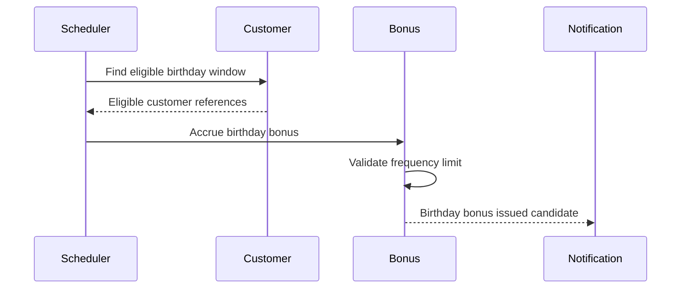

## 24.8 Manual Adjustment With Audit

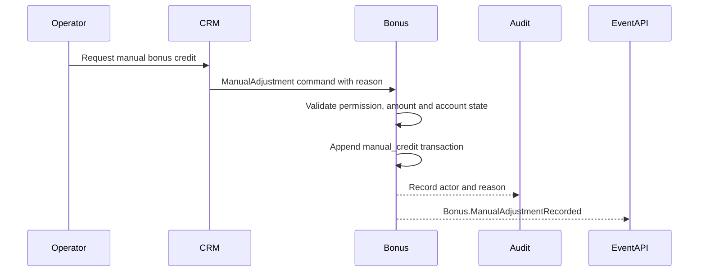

---

# 25. Domain Events

Bonus events use Event API `<Domain>.<Fact>` naming.

Recommended events:

| Event | Produced after | Meaning |
|---|---|---|
| `Bonus.AccountCreated` | Bonus Account created. | Customer has a Bonus Account. |
| `Bonus.AccountActivated` | Account became active. | Bonus operations can run by policy. |
| `Bonus.AccountFrozen` | Account frozen. | Redemption and reservation blocked. |
| `Bonus.AccountRestored` | Account restored. | Normal operations resumed. |
| `Bonus.AccountClosed` | Account closed. | New operations disabled. |
| `Bonus.Accrued` | Bonus rights accrued. | New bonus batch exists. |
| `Bonus.Activated` | Pending rights became active. | Customer can reserve rights. |
| `Bonus.Reserved` | Rights reserved. | Checkout hold accepted. |
| `Bonus.ReservationReleased` | Reservation released. | Rights returned to active pool. |
| `Bonus.Redeemed` | Reserved rights redeemed. | Discount effect consumed rights. |
| `Bonus.Expired` | Rights expired. | Rights no longer usable. |
| `Bonus.Cancelled` | Rights cancelled. | Source or policy invalidated rights. |
| `Bonus.Reversed` | Previous operation compensated. | Correction recorded. |
| `Bonus.ReferralBonusAccrued` | Referral reward accrued. | Referral bonus issued. |
| `Bonus.BirthdayBonusAccrued` | Birthday reward accrued. | Birthday bonus issued. |
| `Bonus.TrustedCustomerBonusAccrued` | Trusted customer reward accrued. | Trusted customer bonus issued. |
| `Bonus.SeasonalBonusAccrued` | Seasonal campaign reward accrued. | Seasonal bonus issued. |
| `Bonus.ManualAdjustmentRecorded` | Manual adjustment accepted. | Operator action recorded. |
| `Bonus.UpcomingExpirationDetected` | Notification candidate found. | Notification Scheduler can request message. |
| `Bonus.BurnSchedulerRunCompleted` | Burn Scheduler completed run. | Scheduled policy execution completed. |
| `Bonus.FraudReviewRequested` | Suspicious bonus activity found. | Review required. |
| `Bonus.ProjectionChanged` | Projection changed. | Bonus summary updated. |

Minimal event payload:

```json
{
  "bonus_account_id": "bonus_account_01JZ0000000000000000000000",
  "customer_id": "customer_01JZ0000000000000000000000",
  "bonus_transaction_id": "bonus_tx_01JZ0000000000000000000000",
  "bonus_batch_id": "bonus_batch_01JZ0000000000000000000000",
  "source_type": "purchase",
  "source_id": "order_01JZ0000000000000000000000",
  "amount": 10,
  "bonus_unit": "bonus",
  "rule_id": "bonus_rule_purchase_default",
  "rule_version": 1,
  "active_bonus": 50,
  "reserved_bonus": 0,
  "pending_bonus": 0,
  "expires_at": "2026-10-04T00:00:00Z",
  "correlation_id": "corr_01JZ0000000000000000000000"
}
```

Event rules:

- events are facts, not commands;
- payload fields use snake_case;
- payloads include stable IDs and rule versions;
- events must not contain raw phone, raw email, payment credentials, provider secrets or raw CRM notes;
- consumers must be idempotent;
- replay rebuilds projections but must not repeat payment, machine or notification side effects;
- every event should have a future Event Registry entry before production use.

---

# 26. Commands and Queries

Future commands:

| Command | Purpose |
|---|---|
| `CreateBonusAccount` | Create account for customer. |
| `ActivateBonusAccount` | Activate account after prerequisites pass. |
| `FreezeBonusAccount` | Block redemption and reservation for review. |
| `RestoreBonusAccount` | Restore account after review. |
| `CloseBonusAccount` | Close account for new operations. |
| `AccrueBonus` | Create pending or active bonus batch. |
| `ActivatePendingBonus` | Move pending bonus to active. |
| `ReserveBonus` | Reserve active bonus rights. |
| `ReleaseBonusReservation` | Release reservation after failure or timeout. |
| `RedeemBonusReservation` | Consume reserved rights as discount effect. |
| `ExpireBonusBatch` | Expire due bonus batch. |
| `CancelBonusBatch` | Cancel pending or active rights. |
| `ReverseBonusTransaction` | Compensate previous transaction. |
| `ApplyManualBonusAdjustment` | Apply audited operator adjustment. |
| `EvaluateReferralBonus` | Evaluate referral reward eligibility. |
| `EvaluateBirthdayBonus` | Evaluate birthday reward eligibility. |
| `EvaluateTrustedCustomerBonus` | Evaluate trusted reward eligibility. |
| `EvaluateSeasonalBonus` | Evaluate seasonal reward eligibility. |
| `RunBonusBurnScheduler` | Execute due burn policies. |
| `RunBonusNotificationScheduler` | Detect and request notification candidates. |
| `RebuildBonusProjection` | Rebuild projection from history. |

Future queries:

| Query | Purpose |
|---|---|
| `GetBonusAccount` | Read account state. |
| `GetBonusProjection` | Read active, reserved, pending and expiring counters. |
| `GetBonusHistory` | Read customer-visible transaction history. |
| `GetBonusBatches` | Read active, reserved, expired or cancelled batches. |
| `GetBonusReservations` | Read open reservations. |
| `GetBonusAuditTrail` | Read authorized audit. |
| `GetBonusRules` | Read active or historical rule versions. |
| `GetExpiringBonus` | Read upcoming expiration details. |
| `GetBonusSchedulerRuns` | Read scheduler execution history. |

Command/query rules:

- commands require actor, source and correlation metadata;
- side-effect commands require idempotency;
- customer queries can read only the customer's own bonus account;
- CRM/support queries require authorization and audit;
- queries must not expose raw personal data, payment secrets or internal fraud notes.

---

# 27. Business Rules

1. Bonus is a non-monetary discount right.
2. One bonus has nominal discount value of 1 RUB only when platform rules allow redemption.
3. Bonus is not Wallet balance.
4. Bonus is not Club Account balance.
5. Bonus is not a payment method.
6. Bonus cannot be withdrawn, transferred as cash or paid out.
7. Bonus redemption reduces payable price before payment.
8. Bonus redemption cannot make payable amount negative.
9. Bonus Account belongs to one `customer_id`.
10. Bonus Account creation does not grant bonus rights by itself.
11. Every bonus operation is append-only.
12. Corrections use compensating transactions.
13. Every accrual has source, rule ID, rule version and idempotency key.
14. Every batch has activation and expiration policy.
15. Non-expiring bonuses require explicit Product Owner-approved policy.
16. Active bonuses can be reserved.
17. Reserved bonuses cannot be reused in another checkout.
18. Redemption consumes reserved bonuses.
19. Reservation timeout must release, expire or route to review by policy.
20. Expiration is evaluated by batch.
21. Expired bonuses cannot be restored by UI state.
22. Redemption consumes nearest-expiring eligible batches first unless rule version overrides it.
23. Referral bonuses require approved referral qualification.
24. Self-referral is forbidden.
25. Birthday bonuses require approved profile and consent policy.
26. Birthday bonuses are frequency-limited by rule.
27. Trusted customer bonus requires approved trusted status or operator rule.
28. Trusted status is not an authorization role.
29. Seasonal bonuses require campaign ID and rule version.
30. Manual adjustments require actor, role, reason and audit.
31. Burn Scheduler must be idempotent.
32. Notification Scheduler must not deliver messages directly.
33. Notification delivery failure does not rollback bonus state.
34. Bonus events must not contain secrets or unnecessary personal data.
35. UI must not calculate, reserve, redeem, expire or adjust bonuses.
36. Discount Engine owns stacking and final discount effect.
37. Pricing Engine owns product price and bonus redemption cap.
38. Payment Engine collects only accepted payable amount.
39. Ledger may reference bonus redemption as discount context but not bonus balance as money.
40. Wallet and Club Account displays must label bonus rights separately from money.
41. Fraud review freezes redemption and reservation but does not delete history.
42. Account close preserves history.
43. Rule edits do not rewrite historical transactions.
44. Event consumers must be idempotent.
45. Replay must not repeat notifications, payments, rewards or machine commands.

---

# 28. Relationships With Other Domains

| Domain | Relationship | Boundary |
|---|---|---|
| Customer | Provides `customer_id`, club status, trust status, birth date and referral relationship facts. | Customer does not mutate bonuses. |
| Club Account | May be shown near bonuses in customer experience. | Club Account balance is prepaid money; Bonus is discount right. |
| Consent | Provides consent evidence and communication permissions. | Bonus stores references and checks policy, not legal evidence source. |
| Checkout | Coordinates bonus reservation and release. | Checkout does not mutate bonus projection directly. |
| Pricing | Calculates gross price and possible bonus redemption cap. | Bonus does not calculate product price. |
| Discount | Applies bonus redemption as a discount effect and controls stacking. | Bonus owns rights; Discount owns final payable amount. |
| Order | Provides accepted order facts for purchase rewards and redemption completion. | Order owns lifecycle and snapshots. |
| Payment | Confirms payment success/failure for checkout follow-up. | Payment never accrues or redeems bonuses directly. |
| Wallet | Owns monetary balance projection. | Wallet never stores bonus rights as money. |
| Ledger | Owns financial facts. | Ledger never stores bonus balance as money. |
| Notification | Delivers bonus messages. | Bonus requests candidates; Notification owns templates, channels and delivery. |
| CRM | Reads history and submits approved commands. | CRM does not edit bonus data directly. |
| Promotion | Future owner of campaign authoring and budgets. | Bonus executes approved reward rights. |
| Analytics | Consumes minimized events and projections. | Analytics is not source of truth. |
| Machine | May correlate completed orders. | Machine does not read or mutate bonuses. |
| API/Auth | Routes and secures access. | API handlers do not contain bonus business logic. |

---

# 29. Privacy, Security and Fraud Controls

Security rules:

- customer can access only their own Bonus Account;
- CRM/support access requires least privilege;
- operator commands require actor, role, reason and audit;
- idempotency keys must not contain secrets;
- event payloads must minimize personal data;
- raw payment credentials, provider secrets, Telegram init data, raw phone and raw email are forbidden in bonus events;
- fraud notes require restricted support/audit views.

Fraud controls:

- duplicate accrual detection by source and rule version;
- referral self-referral prevention;
- referral loop and velocity review;
- birthday frequency limit;
- campaign cap and per-customer cap enforcement;
- suspicious manual adjustment review;
- concurrent reservation protection;
- duplicate redemption protection;
- scheduler idempotency and redrive audit;
- account freeze for review;
- projection reconciliation;
- customer/device/payment correlation where legally allowed and consent/policy permits.

Fraud rules:

- suspected abuse may freeze account or specific operations;
- confirmed abuse uses cancellation or reversal;
- fraud review must not edit historical transactions;
- support recovery uses manual adjustment with audit.

---

# 30. Edge Cases

| Edge case | Required behavior |
|---|---|
| Customer has no Bonus Account during checkout | Create or return no-bonus state according to policy; do not fail purchase. |
| Customer has 0 active bonus | Show zero active bonus; allow checkout without bonus. |
| Customer requests more bonus than active amount | Reject or reduce only with explicit customer confirmation. |
| Customer requests more bonus than discount cap | Reject selected amount and return allowed cap. |
| Bonus reservation succeeds but payment fails | Release reservation idempotently. |
| Payment succeeds but bonus redemption callback is delayed | Retry redemption by reservation ID; do not create duplicate redemption. |
| Reservation expires while payment is unknown | Reconcile Payment and Order before release or redemption. |
| Batch expires while reserved | Follow reservation policy; normally do not silently redeem or double expire. |
| Scheduler runs twice for same due batch | Create one expiration transaction by idempotency. |
| Birthday date changed after reward | Do not issue duplicate reward without approved review. |
| Referral inviter and invited resolve to same customer | Cancel or reject referral reward. |
| Campaign rule is edited after accrual | Historical batch keeps original rule version. |
| Manual credit entered for wrong customer | Use reversal and new credit with audit. |
| Customer account suspended | Freeze or restrict redemption by policy; preserve history. |
| Club Account is closed | Bonus Account remains separate unless customer/loyalty closure policy says otherwise. |
| Refund after bonus-accrued order | Reverse or cancel purchase reward according to rule; financial refund remains Payment/Order concern. |

---

# 31. Error Scenarios

Recommended error codes:

| Code | Meaning | Customer recovery |
|---|---|---|
| `BONUS_ACCOUNT_NOT_FOUND` | No Bonus Account exists. | Continue without bonuses or activate account. |
| `BONUS_ACCOUNT_NOT_ACTIVE` | Account is not active. | Complete activation or contact support. |
| `BONUS_ACCOUNT_FROZEN` | Redemption is blocked for review. | Use another discount/payment flow or contact support. |
| `INSUFFICIENT_ACTIVE_BONUS` | Requested amount exceeds active bonus. | Select lower amount. |
| `BONUS_REDEMPTION_LIMIT_EXCEEDED` | Requested amount exceeds pricing/discount cap. | Use allowed amount. |
| `BONUS_RESERVATION_NOT_FOUND` | Reservation reference is unknown. | Reconcile checkout. |
| `BONUS_RESERVATION_EXPIRED` | Reservation expired before completion. | Recalculate checkout. |
| `BONUS_ALREADY_REDEEMED` | Duplicate redemption attempted. | Return existing result. |
| `BONUS_BATCH_EXPIRED` | Selected batch is expired. | Refresh bonus balance. |
| `BONUS_RULE_NOT_ACTIVE` | Rule cannot issue new rewards. | No customer action. |
| `BONUS_SOURCE_NOT_QUALIFIED` | Source fact does not qualify. | Complete qualifying action if applicable. |
| `BONUS_DUPLICATE_ACCRUAL` | Accrual already processed. | Return existing result. |
| `BONUS_MANUAL_REASON_REQUIRED` | Operator command lacks reason. | Operator must provide reason. |
| `BONUS_FRAUD_REVIEW_REQUIRED` | Activity is suspicious. | Support review. |
| `BONUS_PROJECTION_REBUILD_REQUIRED` | Projection is inconsistent. | Wait or contact support. |
| `BONUS_SCHEDULER_REDRIVE_REQUIRED` | Scheduler run failed. | Operations review. |

Error rules:

- customer messages must be simple and avoid internal policy names;
- internal errors include correlation IDs;
- rejected sensitive commands are audited;
- no error may expose secrets, raw personal data or fraud detection details.

---

# 32. Readiness Criteria

Bonus Domain is architecture-ready when:

- Bonus Account is documented;
- Bonus Transaction is documented;
- Bonus Batch and projection model are documented;
- account lifecycle is documented;
- reservation and redemption are documented;
- expiration is documented;
- Burn Scheduler is documented;
- Notification Scheduler is documented;
- Referral Bonus is documented;
- Birthday Bonus is documented;
- Trusted Customer Bonus is documented;
- Seasonal Bonus is documented;
- Manual Adjustment is documented;
- audit model is documented;
- state machines are documented;
- sequence diagrams are documented;
- domain events are documented;
- business rules are documented;
- edge cases and error scenarios are documented;
- relationships with other domains are documented;
- no application source code is modified.

Implementation-ready criteria for future tasks:

- command, query and event schemas are approved;
- Bonus Rule configuration format is approved;
- default expiration policies are approved by Product Owner;
- referral qualification and reward amounts are approved;
- birthday eligibility, consent and reward amounts are approved;
- trusted customer reward criteria are approved;
- seasonal campaign budget and cap policy is approved;
- manual adjustment approval workflow is approved;
- scheduler runtime and idempotency storage are approved;
- Notification templates and throttling are approved;
- test scenarios are prepared.

---

# 33. Future Roadmap

Recommended future tasks:

1. Define Bonus command contracts.
2. Define Bonus query contracts.
3. Define Bonus event payload schemas and Event Registry entries.
4. Define Bonus Account repository and projection rebuild contract.
5. Define Bonus Transaction append-only storage model.
6. Define Bonus Rule configuration and approval workflow.
7. Define default expiration policies by source type.
8. Define Burn Scheduler runtime, locking, cursor and redrive policy.
9. Define Notification Scheduler integration with Notification Runtime.
10. Define checkout reservation, redemption and release contracts.
11. Define Discount/Pricing bonus cap and stacking contract.
12. Define purchase reward policy after order/payment completion.
13. Define referral qualification, reward amount and anti-abuse rules.
14. Define birthday reward consent, eligibility and frequency rules.
15. Define trusted customer reward criteria and audit requirements.
16. Define seasonal campaign reward contract with future Promotion Runtime.
17. Define manual adjustment approval workflow and CRM support view.
18. Define fraud review queue and account freeze workflows.
19. Define analytics and reporting projections for accrual, redemption, expiration and campaign performance.
20. Add test scenarios for account lifecycle, accrual, reservation, redemption, release, expiration, scheduler runs, referral, birthday, trusted, seasonal and manual adjustment flows.
21. Implement Bonus Runtime only after contracts and Product Owner-approved commercial rules are ready.

---

# Documentation Scope

This document is documentation-only.

It does not introduce application code, frontend code, backend code, Telegram bot code, runtime configuration, database migrations, payment provider integration, notification templates, CRM screens, generated build output or final legal/commercial bonus values.
