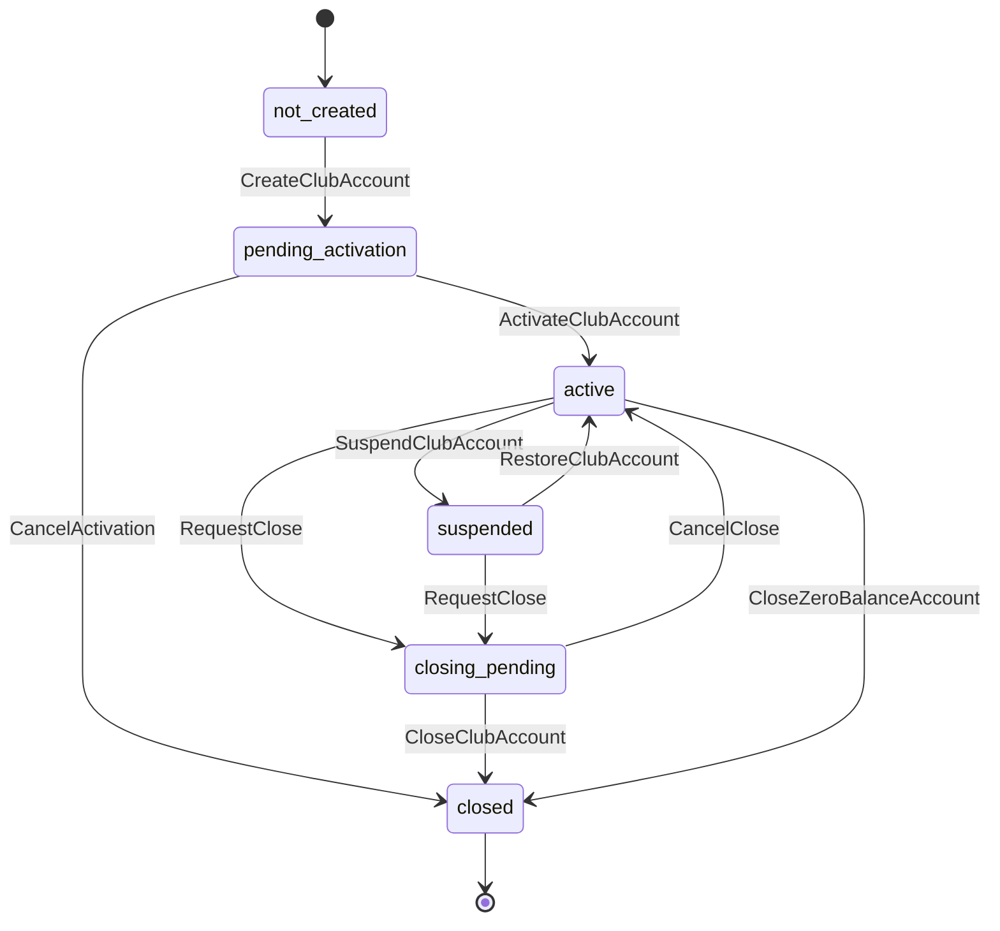
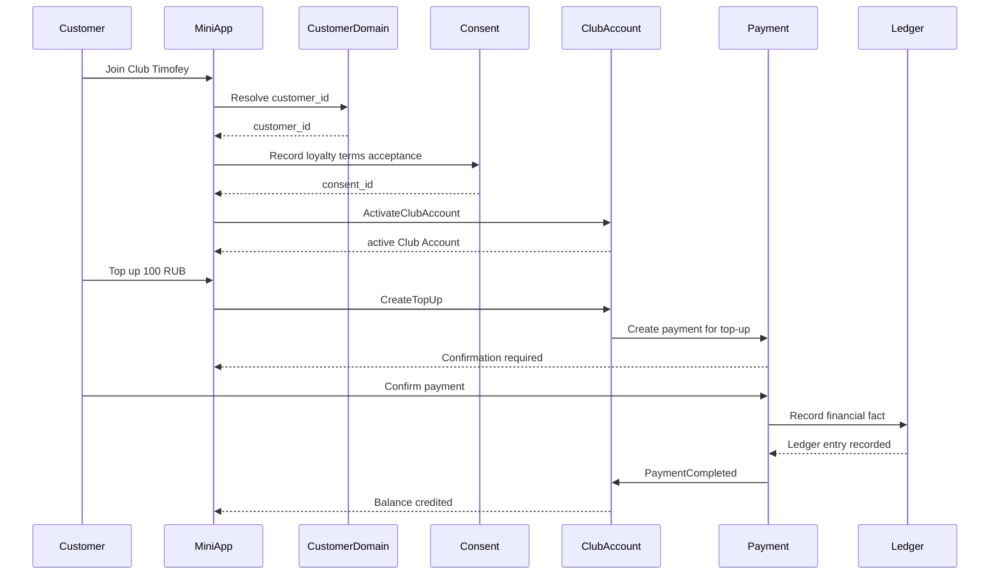
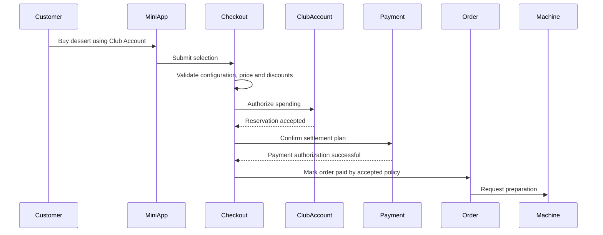
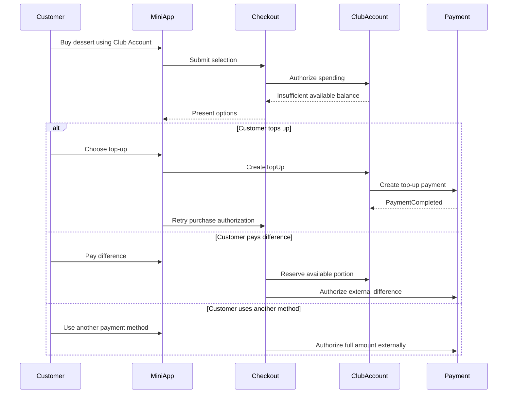
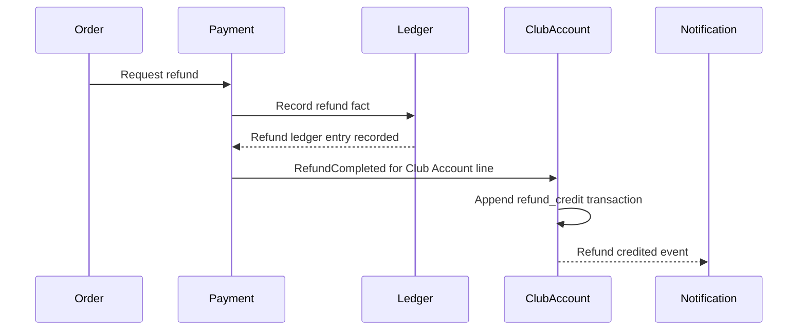
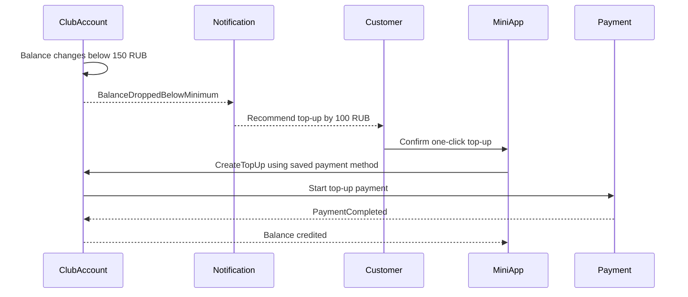

# Club Account Domain

Document code: DOMAIN-CLUB-ACCOUNT-001
Task: EPIC-300 / DOMAIN-002
Version: 0.1
Status: Draft
Project: Soft ICE Platform / Utimoshi
Owner: Product Owner Alexander Ilyin
Created: 2026-07-06
Last updated: 2026-07-06
Scope: Documentation only

Related documents:

- `AGENTS.md`
- `PROJECT_MEMORY.md`
- `docs/architecture/ARCHITECTURE_PRINCIPLES.md`
- `docs/architecture/DDD_LITE_ARCHITECTURE.md`
- `docs/architecture/PROJECT_DECISIONS.md`
- `docs/domain/CUSTOMER_DOMAIN.md`
- `docs/domain/CONSENT_MODEL.md`
- `docs/architecture/WALLET.md`
- `docs/architecture/LEDGER.md`
- `docs/architecture/PAYMENT_ENGINE.md`
- `docs/architecture/BONUS_ENGINE.md`
- `docs/architecture/DISCOUNT_ENGINE.md`
- `docs/architecture/CHECKOUT.md`
- `docs/architecture/ORDER_PLATFORM.md`
- `docs/api/EVENT_API.md`
- `docs/tasks/TASK_INDEX.md`

---

# 1. Purpose

Club Account describes the customer-facing prepaid account used inside Soft ICE Platform and Club Timofey flows.

The domain exists so the platform can:

- activate a customer's Club Account after explicit membership action and accepted terms;
- show the customer's prepaid platform balance;
- reserve prepaid balance for checkout;
- spend prepaid balance after payment authorization and order acceptance;
- top up prepaid balance through approved Payment Engine flows;
- recommend a top-up when balance is low;
- keep an immutable transaction history;
- support refunds, suspension, restoration and account closing without deleting financial history;
- connect Club Account activity to Customer, Order, Payment, Wallet, Ledger, Bonus, Discount, Notification, CRM and Analytics through clear contracts.

Core rules:

```text
Club Account is not a bank account.
Club Account funds are prepaid balance for purchases inside Soft ICE Platform.
Club Account balance is not bonus balance.
Bonus = right to discount of 1 ₽.
No automatic debit is allowed without explicit customer consent.
Purchase preparation starts only after successful payment authorization.
Transaction history is immutable.
```

The domain is documentation-only in this increment and introduces no application code.

---

# 2. DDD Lite Boundary

Club Account is a DDD Lite bounded context connected to Customer Platform and Finance Platform.

Architecture position:

```text
Customer Domain
->
Club Account Domain
->
Checkout / Order
->
Payment Engine
->
Transaction / Ledger / Wallet projection
->
Notification / CRM / Analytics
```

Club Account owns:

- club account identity;
- customer-facing club account lifecycle;
- prepaid balance rules and thresholds;
- available and reserved balance read model;
- minimum recommended balance rule;
- recommended top-up rule;
- top-up intent model;
- spending authorization model;
- refund application model;
- saved payment method consent state for Club Account use;
- auto top-up policy state;
- immutable account history;
- account audit metadata;
- Club Account domain events.

Club Account does not own:

- bank accounts or payment provider accounts;
- raw card data or saved card storage;
- external payment provider settlement;
- Ledger as the financial source of truth;
- generic Wallet projection implementation;
- product price calculation;
- discount stacking;
- bonus accrual, reservation, redemption or expiration;
- Order lifecycle;
- machine preparation;
- notification delivery;
- CRM screen behavior;
- API route authorization.

Financial source-of-truth rule:

```text
Ledger is the source of truth for financial facts.
Wallet may expose a Ledger-backed projection.
Club Account exposes the customer-facing prepaid account model and business rules.
```

Future implementation must reconcile Club Account balance with Ledger-backed Wallet facts. UI must never mutate or reconstruct Club Account balance locally.

---

# 3. Ubiquitous Language

| Term | Meaning |
|---|---|
| Club Account | Customer-facing prepaid account for purchases inside Soft ICE Platform. |
| Club Account ID | Stable identifier stored as `club_account_id`. |
| Customer ID | Canonical platform customer identifier from Customer Domain. |
| Membership | Customer's Club Timofey participation state. |
| Available Balance | Prepaid RUB amount available for reservation or spending. |
| Reserved Balance | Prepaid RUB amount temporarily held for unfinished purchase or operation. |
| Total Balance | `available_balance + reserved_balance`. |
| Minimum Recommended Balance | Business threshold of 150 ₽. |
| Recommended Top-Up | System recommendation to add 100 ₽. |
| Top-Up | Customer-initiated prepaid balance increase through Payment Engine. |
| Spending | Captured use of prepaid balance for an accepted purchase. |
| Refund | Compensating operation that returns value according to refund policy. |
| Saved Payment Method | Provider-safe payment method reference saved after explicit consent. It is not a saved card. |
| One-Click Top-Up | Customer-confirmed top-up using a saved payment method reference. |
| Auto Top-Up | Optional consented policy that may start a top-up flow under configured limits. |
| Purchase Authorization | Club Account and Payment acceptance that prepaid or external funds can cover the purchase. |
| Account History | Customer-visible immutable list of account transactions. |
| Audit Trail | Operator/system-visible immutable record with actor, reason, consent and correlation data. |

Customer-facing UI should use business language such as "Club Account", "Top up", "Balance", "Use balance" and "Join Club Timofey". It must not describe the Club Account as a bank account, deposit, card account or cash wallet.

---

# 4. Club Account Entity

The main aggregate is `ClubAccount`.

Minimal entity model:

```json
{
  "club_account_id": "club_account_01JZ0000000000000000000000",
  "customer_id": "customer_01JZ0000000000000000000000",
  "club_membership_id": "club_member_01JZ0000000000000000000000",
  "status": "active",
  "currency": "RUB",
  "available_balance": 150,
  "reserved_balance": 0,
  "total_balance": 150,
  "minimum_recommended_balance": 150,
  "recommended_top_up_amount": 100,
  "low_balance_state": "ok",
  "saved_payment_method": {
    "status": "not_saved",
    "consent_id": null,
    "provider_method_reference": null
  },
  "auto_top_up": {
    "status": "disabled",
    "consent_id": null,
    "threshold_amount": 150,
    "top_up_amount": 100,
    "daily_limit": null,
    "monthly_limit": null
  },
  "audit": {
    "created_by": "system",
    "created_from": "telegram_mini_app",
    "terms_version": "2026-07-06.v1"
  },
  "created_at": "2026-07-06T00:00:00Z",
  "updated_at": "2026-07-06T00:00:00Z",
  "version": 1
}
```

Entity invariants:

- one active Club Account belongs to one `customer_id`;
- one customer may have at most one active Club Account per currency unless a future multi-account policy is approved;
- MVP currency is `RUB`;
- `available_balance >= 0`;
- `reserved_balance >= 0`;
- `total_balance = available_balance + reserved_balance`;
- balance changes are accepted only through immutable transactions;
- minimum recommended balance is 150 ₽;
- recommended top-up amount is 100 ₽;
- saved payment method is a provider-safe reference, not raw card data;
- auto top-up is disabled unless explicit consent and limits exist;
- account history is append-only.

---

# 5. Account Lifecycle

Club Account lifecycle:

```text
not_created
->
pending_activation
->
active
|-> suspended -> active
|-> closing_pending -> closed
|-> closed
```

Lifecycle states:

| State | Meaning | Allowed operations |
|---|---|---|
| `not_created` | No Club Account exists for the customer. | Create activation intent. |
| `pending_activation` | Membership or consent requirements are incomplete. | Accept terms, verify customer context, cancel activation. |
| `active` | Account can top up, reserve, spend, refund and receive notifications according to rules. | Normal operations. |
| `suspended` | New top-ups and spending are blocked during review or by customer/support request. | Reads, refunds, releases, restoration review. |
| `closing_pending` | Close requested but unresolved balance, reservation, refund or audit condition remains. | Resolve balance, release reservations, complete refunds. |
| `closed` | Account is closed for new operations and retained for history. | Read history and audit only. |

Lifecycle rules:

- activation requires a valid `customer_id`;
- activation requires explicit Club Timofey membership action and accepted terms;
- active Club Account does not imply discount, bonus or trusted customer eligibility;
- suspension does not delete balance or history;
- restoration does not create balance;
- closing requires no active reservations;
- closing with positive available balance requires an approved refund, transfer, spend-down or retention policy;
- closed accounts keep immutable history and legally required references.

---

# 6. Balance Model

Club Account balance is customer-facing prepaid value in RUB.

Important rule:

```text
Club Account balance is not a bank deposit, not credit, not interest-bearing and not withdrawable cash unless an approved refund policy allows compensation.
```

Balance fields:

| Field | Meaning |
|---|---|
| `available_balance` | Prepaid amount available for a new reservation or purchase. |
| `reserved_balance` | Prepaid amount held for unfinished purchase or operation. |
| `total_balance` | Sum of available and reserved balances. |
| `currency` | MVP currency, `RUB`. |
| `version` | Optimistic aggregate or projection version. |
| `source_ledger_position` | Future reference to the Ledger position used to build the balance. |

Balance invariants:

- available balance cannot become negative;
- reserved balance cannot become negative;
- reserve moves amount from available to reserved;
- release moves amount from reserved to available;
- capture/spending decreases reserved and total balance;
- top-up increases available balance after successful payment confirmation and Ledger-backed recording policy;
- refund increases available balance or releases reservation according to refund type;
- corrections are new transactions, not edits to previous transactions.

Balance change examples:

```text
Top-up +100:
available_balance += 100

Reserve purchase 130:
available_balance -= 130
reserved_balance += 130

Capture purchase 130:
reserved_balance -= 130
total_balance -= 130

Release reservation 130:
reserved_balance -= 130
available_balance += 130
```

---

# 7. Minimum Balance and Top-Up Recommendation

Minimum recommended balance:

```text
150 ₽
```

Recommended top-up amount:

```text
100 ₽
```

Rules:

- 150 ₽ is a minimum recommended balance, not a bank minimum and not a debt limit.
- The platform must notify the user automatically when `available_balance` drops below 150 ₽.
- The system always recommends topping up by 100 ₽.
- The user may choose another amount when provider, policy and validation rules allow it.
- A balance below 150 ₽ does not block spending by itself if available balance is sufficient for the selected purchase.
- If spending causes the balance to cross from `>= 150` to `< 150`, a low-balance event must be emitted.
- Repeated notifications must be throttled by Notification policy so the customer is not spammed.
- A custom top-up that still leaves balance below 150 ₽ is allowed, but the account remains in low-balance state.

Low balance state:

| State | Meaning |
|---|---|
| `ok` | Available balance is at least 150 ₽. |
| `below_minimum` | Available balance is below 150 ₽ and notification should be considered. |
| `notification_sent` | Low-balance notification was requested for the current low-balance episode. |
| `suppressed` | Notification is temporarily suppressed by consent, channel or throttling policy. |

Low-balance flow:

```text
Balance changed
->
available_balance < 150 ₽
->
ClubAccounts.BalanceDroppedBelowMinimum
->
Notification requested
->
Recommend top-up by 100 ₽
```

---

# 8. Membership Activation

Club Account activation is tied to Club Timofey membership.

Activation prerequisites:

- stable `customer_id`;
- customer is not closed or blocked in Customer Domain;
- Club Timofey membership action is explicit;
- required terms are accepted and versioned;
- required consent references are recorded;
- account does not already exist as active for the same customer and currency;
- fraud or compliance checks do not reject activation.

Activation flow:

```text
Customer chooses Join Club Timofey
->
Customer Domain validates or creates customer_id
->
Consent records loyalty terms acceptance
->
Club Account created in pending_activation
->
Activation prerequisites pass
->
Club Account becomes active
```

Activation rules:

- activation may create an active account with zero balance;
- activation does not create bonus rights by itself unless Bonus Engine accepts a separate accrual rule;
- activation does not create a discount unless Discount Engine accepts a separate membership rule;
- activation does not save a payment method;
- activation publishes an event after the account becomes active.

---

# 9. Membership Suspension

Suspension temporarily blocks sensitive Club Account operations.

Allowed suspension reasons:

- customer request;
- support review;
- suspected fraud;
- payment risk;
- identity conflict;
- legal or compliance review;
- operational incident;
- Product Owner or authorized operator action.

Suspension effects:

| Operation | Suspended behavior |
|---|---|
| Read balance | Allowed for authorized customer/support views. |
| Read history | Allowed. |
| Top-up | Blocked unless support policy explicitly allows. |
| One-click top-up | Blocked. |
| Auto top-up | Disabled while suspended. |
| New spending reservation | Blocked. |
| Existing reservation release | Allowed. |
| Refund into account | Allowed when policy requires value return. |
| Saved payment method consent update | Allowed for revoke, blocked for new debit use. |
| Closing request | Allowed, usually moves to `closing_pending`. |

Suspension rules:

- suspension must include actor, reason and source;
- suspension must not change balance amounts;
- active reservations must be released, captured or routed to review according to purchase state;
- saved payment method references must not be used while account is suspended;
- suspension publishes `ClubAccounts.Suspended`.

---

# 10. Membership Restoration

Restoration moves a suspended Club Account back to active status.

Restoration prerequisites:

- suspension reason is resolved;
- customer identity is not in conflict;
- required consent and terms remain valid or are re-accepted;
- payment risk review allows account use;
- no unresolved dangerous reservation or refund conflict remains;
- authorized actor, reason and audit metadata are recorded.

Restoration rules:

- restoration does not create or remove balance;
- restoration does not automatically re-enable auto top-up if consent expired or was revoked;
- restoration may leave saved payment method in `disabled` state until user reconfirms consent;
- restoration publishes `ClubAccounts.Restored`;
- if available balance is below 150 ₽ after restoration, low-balance notification may be requested according to throttling and consent rules.

---

# 11. Account Closing

Closing stops future Club Account operations while preserving history.

Closing may be initiated by:

- customer request;
- support request;
- account closure in Customer Domain;
- legal or compliance policy;
- migration to a future account model;
- Product Owner-approved operational process.

Closing prerequisites:

- no active purchase reservations;
- no pending top-up confirmation;
- no unresolved refund;
- no manual review state that blocks closure;
- saved payment method consent is revoked or detached;
- remaining available balance is resolved according to approved policy.

Positive balance policy:

```text
Closing with positive available balance requires Product Owner-approved refund, transfer, spend-down or retention policy.
```

Closing states:

| State | Meaning |
|---|---|
| `closing_pending` | Close requested but some condition remains unresolved. |
| `closed` | No new top-ups, spending, reservations or saved method use are allowed. |

Closing rules:

- closing never deletes account history;
- closing never edits previous transactions;
- refunds after closure are handled by a dedicated support or finance workflow;
- closed account can be read for history, audit, support and legally required reporting;
- reopening a closed account requires a future Product Owner-approved policy.

---

# 12. Transaction Model

Club Account keeps immutable transaction history.

Transaction model:

```json
{
  "club_account_transaction_id": "club_tx_01JZ0000000000000000000000",
  "club_account_id": "club_account_01JZ0000000000000000000000",
  "customer_id": "customer_01JZ0000000000000000000000",
  "transaction_type": "top_up_credit",
  "direction": "credit",
  "amount": 100,
  "currency": "RUB",
  "status": "posted",
  "available_delta": 100,
  "reserved_delta": 0,
  "available_balance_after": 250,
  "reserved_balance_after": 0,
  "source_domain": "payment",
  "source_id": "payment_01JZ0000000000000000000000",
  "ledger_entry_id": "ledger_entry_01JZ0000000000000000000000",
  "order_id": null,
  "reservation_id": null,
  "idempotency_key": "club_top_up_01JZ",
  "actor": {
    "actor_type": "customer",
    "actor_id": "customer_01JZ0000000000000000000000"
  },
  "reason": "customer_top_up",
  "created_at": "2026-07-06T00:00:00Z",
  "posted_at": "2026-07-06T00:00:05Z"
}
```

Transaction types:

| Type | Meaning | Balance effect |
|---|---|---|
| `account_activated` | Account became active. | None. |
| `top_up_requested` | Top-up intent created. | None. |
| `top_up_credit` | Successful top-up credited. | Available increases. |
| `top_up_failed` | Top-up failed or expired. | None. |
| `purchase_reserved` | Funds reserved for purchase. | Available decreases, reserved increases. |
| `purchase_capture` | Reserved funds spent. | Reserved decreases, total decreases. |
| `reservation_released` | Reservation returned to available. | Reserved decreases, available increases. |
| `refund_credit` | Refund credited to account. | Available increases. |
| `operator_adjustment_credit` | Approved support credit. | Available increases. |
| `operator_adjustment_debit` | Approved support debit correction. | Available decreases only through policy. |
| `account_suspended` | Account suspended. | None. |
| `account_restored` | Account restored. | None. |
| `account_closed` | Account closed. | None. |
| `payment_method_consent_granted` | Saved method consent granted. | None. |
| `payment_method_consent_revoked` | Saved method consent revoked. | None. |
| `auto_top_up_policy_enabled` | Auto top-up policy enabled. | None. |
| `auto_top_up_policy_disabled` | Auto top-up policy disabled. | None. |

Transaction rules:

- transactions are append-only;
- posted transactions are immutable;
- corrections use new compensating transactions;
- every balance-changing transaction includes amount, currency and balance deltas;
- every sensitive transaction includes actor, reason, source and correlation metadata;
- every externally triggered transaction requires idempotency;
- transactions must not contain raw card data, provider secrets or raw personal data;
- customer history may show a safe subset of transactions;
- audit trail keeps the full permitted operational metadata.

---

# 13. Top-Up Model

Top-up is a customer-initiated increase of prepaid Club Account balance.

Top-up intent model:

```json
{
  "top_up_id": "top_up_01JZ0000000000000000000000",
  "club_account_id": "club_account_01JZ0000000000000000000000",
  "customer_id": "customer_01JZ0000000000000000000000",
  "amount": 100,
  "currency": "RUB",
  "recommended": true,
  "status": "awaiting_confirmation",
  "payment_id": "payment_01JZ0000000000000000000000",
  "payment_method_type": "saved_payment_method",
  "saved_payment_method_id": "spm_01JZ0000000000000000000000",
  "confirmation_required": true,
  "confirmation_expires_at": "2026-07-06T00:15:00Z",
  "idempotency_key": "top_up_customer_01JZ_100",
  "created_at": "2026-07-06T00:00:00Z"
}
```

Top-up lifecycle:

```text
created
->
awaiting_confirmation
->
authorized
->
captured
->
credited
```

Failure states:

```text
created / awaiting_confirmation / authorized
->
failed

created / awaiting_confirmation
->
cancelled

awaiting_confirmation
->
expired

ambiguous provider or ledger state
->
manual_review
```

Top-up rules:

- default recommendation is always 100 ₽;
- user may choose another amount when validation allows it;
- top-up amount must be positive;
- top-up amount must be in RUB for MVP;
- top-up starts only after explicit customer action or active, separate auto top-up consent;
- top-up credit is posted only after Payment Engine confirms payment according to Payment and Ledger policy;
- failed, cancelled or expired top-up must not change balance;
- duplicate provider callbacks must not credit twice;
- top-up records must not store raw card data or provider secrets;
- top-up completion may resolve low-balance state if available balance becomes at least 150 ₽.

---

# 14. Spending Model

Spending uses Club Account prepaid balance for accepted purchases inside Soft ICE Platform.

Spending intent model:

```json
{
  "spending_id": "club_spend_01JZ0000000000000000000000",
  "club_account_id": "club_account_01JZ0000000000000000000000",
  "customer_id": "customer_01JZ0000000000000000000000",
  "order_id": "order_01JZ0000000000000000000000",
  "checkout_intent_id": "checkout_01JZ0000000000000000000000",
  "reservation_id": "club_reservation_01JZ0000000000000000000000",
  "amount": 130,
  "currency": "RUB",
  "status": "reserved",
  "expires_at": "2026-07-06T00:15:00Z"
}
```

Spending lifecycle:

```text
requested
->
authorized
->
reserved
->
captured
```

Failure and cleanup states:

```text
requested -> rejected
reserved -> released
reserved -> expired
reserved -> manual_review
captured -> refund_pending -> refunded
```

Spending rules:

- spending can occur only for purchases inside the platform;
- spending amount comes from accepted checkout payable amount or payment method line;
- Club Account does not calculate product price, discounts or bonuses;
- if available balance is sufficient, Club Account may reserve the needed amount;
- if available balance is insufficient, customer may top up, pay the difference or use another payment method;
- no spending capture happens from UI state alone;
- capture occurs only after successful payment authorization/settlement policy is satisfied;
- captured spending is immutable and can be compensated only by refund;
- reservations must expire or be released when checkout fails, is cancelled or times out;
- reservation and capture must be idempotent.

Insufficient balance options:

| Option | Meaning |
|---|---|
| Top up | Customer increases Club Account balance, then retries purchase. |
| Pay difference | Available Club Account balance is reserved and remaining amount is paid by another method. |
| Use another payment method | Customer pays full amount with card, SBP or another approved method. |

---

# 15. Refund Handling

Refund is a compensating operation. It never edits original transactions.

Refund types:

| Type | Meaning |
|---|---|
| `reservation_release` | Purchase did not capture; reserved balance returns to available. |
| `club_account_refund` | Captured Club Account spending is returned to available balance. |
| `external_method_refund` | External payment method line is refunded through Payment Engine. |
| `mixed_refund` | Refund preserves Club Account and external method-line attribution. |
| `support_credit` | Approved service recovery credit to Club Account. |

Refund model:

```json
{
  "refund_id": "refund_01JZ0000000000000000000000",
  "club_account_id": "club_account_01JZ0000000000000000000000",
  "customer_id": "customer_01JZ0000000000000000000000",
  "order_id": "order_01JZ0000000000000000000000",
  "original_transaction_id": "club_tx_01JZ_ORIGINAL",
  "amount": 130,
  "currency": "RUB",
  "refund_type": "club_account_refund",
  "status": "completed",
  "reason": "machine_fulfillment_failed",
  "ledger_entry_id": "ledger_entry_01JZ0000000000000000000000"
}
```

Refund rules:

- refund must reference original order, payment, spending or reservation facts;
- refund amount cannot exceed eligible captured amount minus previous refunds;
- refund of reserved but uncaptured funds is release, not payment refund;
- refund of captured Club Account spending creates a new credit transaction;
- refund of external method lines belongs to Payment Engine provider flow;
- mixed payment refund preserves method-line attribution;
- refund to closed account requires future approved support/finance policy;
- refund failure moves to retry or manual review;
- refund events must not contain provider secrets or raw card data.

---

# 16. Bonus Interaction

Bonus balance is independent from Club Account.

Core rule:

```text
Bonus = right to discount of 1 ₽.
```

Interaction rules:

- Bonus Engine owns bonus accrual, reservation, redemption, release, expiration and reversal.
- Club Account never stores bonuses as balance.
- Club Account never converts bonuses to prepaid funds.
- Bonus redemption reduces payable amount before Club Account spending is authorized.
- Club Account spending uses the payable amount after Pricing/Discount/Bonus decisions.
- Refund of redeemed bonuses is handled by Bonus Engine policy, not by Club Account balance.
- Customer UI may show Club Account balance and bonus rights together only when clearly labeled separately.

Example:

```text
Gross amount: 130 ₽
Bonus discount: 20 ₽
Payable amount: 110 ₽
Club Account spending reservation: 110 ₽
```

The customer does not have 20 ₽ more in Club Account. The customer used 20 bonus rights to reduce the payable price.

---

# 17. Auto Top-Up

Auto top-up is optional and disabled by default.

Auto top-up policy model:

```json
{
  "auto_top_up_policy_id": "auto_top_up_01JZ0000000000000000000000",
  "club_account_id": "club_account_01JZ0000000000000000000000",
  "status": "enabled",
  "trigger": "below_minimum_recommended_balance",
  "threshold_amount": 150,
  "top_up_amount": 100,
  "currency": "RUB",
  "saved_payment_method_id": "spm_01JZ0000000000000000000000",
  "consent_id": "consent_01JZ0000000000000000000000",
  "requires_confirmation": true,
  "daily_limit": 1,
  "monthly_amount_limit": 1000,
  "last_triggered_at": null
}
```

Auto top-up rules:

- no automatic debit is allowed without explicit customer consent;
- auto top-up consent is separate from saved payment method consent;
- enabling auto top-up requires amount, threshold, payment method reference, limits and consent version;
- default auto top-up amount is 100 ₽ unless customer explicitly chooses another configured amount;
- auto top-up must respect provider confirmation requirements;
- if provider or law requires confirmation, auto top-up creates a confirmation request and does not credit balance until confirmed;
- auto top-up is blocked when account is suspended, closing or closed;
- auto top-up must have loop prevention, velocity limits and monthly caps;
- failed auto top-up must not retry indefinitely;
- customer can disable auto top-up at any time;
- revoking saved payment method consent disables auto top-up.

MVP direction:

```text
MVP should support low-balance notification and one-click top-up first.
Fully automatic debit requires separate Product Owner, legal and provider approval.
```

---

# 18. Saved Payment Method

Saved payment method is not a saved card.

Definition:

```text
Saved payment method = provider-safe reference/token/identifier that can be used by Payment Engine after explicit customer consent.
```

Saved payment method model:

```json
{
  "saved_payment_method_id": "spm_01JZ0000000000000000000000",
  "customer_id": "customer_01JZ0000000000000000000000",
  "club_account_id": "club_account_01JZ0000000000000000000000",
  "provider": "yookassa",
  "provider_method_reference": "provider_method_ref_masked",
  "display_label": "Card ending 0000",
  "status": "active",
  "usage_scope": "club_account_top_up",
  "consent_id": "consent_01JZ0000000000000000000000",
  "consent_version": "2026-07-06.v1",
  "created_at": "2026-07-06T00:00:00Z",
  "revoked_at": null
}
```

Saved payment method rules:

- raw card number, CVV, PIN, magnetic stripe data and payment credentials are never stored by Soft ICE Platform;
- method can be saved only after explicit customer consent;
- method can be used for one-click top-up only after explicit consent;
- method cannot be used for ordinary purchase debit unless a separate approved consent and policy exist;
- consent must define scope, provider, usage, revocation path and terms version;
- customer can revoke consent at any time;
- revoked or expired method cannot be used for one-click top-up or auto top-up;
- provider references must be protected and never exposed in public events;
- failed method use must not silently switch to another method without customer action.

---

# 19. Payment Confirmation Flow

Payment confirmation belongs to Payment Engine. Club Account consumes the accepted result.

Top-up confirmation flow:

```text
Top-up intent created
->
Payment Engine creates payment
->
Customer confirms through provider flow or saved method confirmation
->
Payment Engine receives verified provider result
->
Ledger records financial fact according to policy
->
Club Account credits available balance
```

Confirmation rules:

- creating a payment intent is not credit;
- opening a provider confirmation URL is not credit;
- customer redirect back to Mini App is not credit;
- provider callback must be verified by Payment Engine;
- duplicate callback must be idempotent;
- ambiguous provider state requires reconciliation before credit;
- top-up credit publishes a Club Account event only after accepted payment confirmation;
- payment confirmation must not expose provider secrets, raw card data or raw webhook payloads to Club Account.

One-click top-up confirmation:

- one-click still requires explicit customer action for the top-up unless active auto top-up consent exists;
- saved payment method use may still require provider challenge;
- if challenge is required, top-up stays `awaiting_confirmation`;
- failed challenge does not change balance.

---

# 20. Purchase Authorization

Purchase authorization is the point where the platform accepts that a purchase is financially covered.

Mandatory rule:

```text
Purchase preparation starts only after successful payment authorization.
```

For the current vending MVP, this means:

```text
Order/Payment must accept successful payment authorization or completion according to approved Payment policy before machine preparation starts.
```

Club Account purchase authorization inputs:

- `club_account_id`;
- `customer_id`;
- `order_id` or `checkout_intent_id`;
- accepted payable amount;
- currency;
- selected Club Account amount;
- optional external method line for difference;
- idempotency key;
- current account status and balance version.

Authorization cases:

| Case | Result |
|---|---|
| Available balance covers full payable amount | Reserve Club Account amount. |
| Available balance covers part of payable amount | Reserve available part only if customer chooses pay-difference flow. |
| Available balance is insufficient and customer chooses top-up | Create top-up flow before purchase authorization completes. |
| Customer chooses another payment method | Do not reserve Club Account balance unless explicitly selected. |
| Account suspended/closed | Reject Club Account payment method. |
| Currency mismatch | Reject. |

Preparation gate:

```text
Accepted checkout
->
Club Account reservation and/or external payment authorization
->
Payment Engine confirms settlement policy
->
Order becomes Paid under Order policy
->
Machine preparation may start
```

No UI state, redirect, timer or local flag can start preparation.

---

# 21. History

Club Account history is the customer-visible statement of account activity.

History may show:

- account activation;
- top-up requested;
- top-up credited;
- purchase reservation;
- purchase spending;
- reservation release;
- refund;
- support credit;
- low-balance notification;
- saved payment method consent changes;
- auto top-up settings changes;
- suspension, restoration and closure.

History record model:

```json
{
  "history_id": "club_history_01JZ0000000000000000000000",
  "club_account_id": "club_account_01JZ0000000000000000000000",
  "customer_id": "customer_01JZ0000000000000000000000",
  "title": "Top-up",
  "event_type": "top_up_credit",
  "amount": 100,
  "currency": "RUB",
  "display_balance_after": 250,
  "source_reference": "top_up_01JZ0000000000000000000000",
  "occurred_at": "2026-07-06T00:00:00Z"
}
```

History rules:

- customer history is derived from immutable transactions and events;
- history must be ordered by accepted occurrence time and stable sequence;
- history must not contain provider secrets, raw card data, raw phone or raw email;
- pending operations must be clearly labeled;
- reversed or refunded operations must be shown as new entries, not overwritten original entries;
- history must remain accessible after account closure according to retention and privacy policy.

---

# 22. Audit Trail

Audit trail is the operational and compliance record.

Audit record model:

```json
{
  "audit_id": "audit_01JZ0000000000000000000000",
  "club_account_id": "club_account_01JZ0000000000000000000000",
  "customer_id": "customer_01JZ0000000000000000000000",
  "action": "account_suspended",
  "actor_type": "operator",
  "actor_id": "operator_01JZ0000000000000000000000",
  "reason": "payment_risk_review",
  "source_channel": "crm",
  "correlation_id": "corr_01JZ0000000000000000000000",
  "causation_id": "evt_01JZ0000000000000000000000",
  "idempotency_key": "suspend_club_account_01JZ",
  "metadata": {
    "policy_id": "club_account_risk_policy_2026"
  },
  "occurred_at": "2026-07-06T00:00:00Z"
}
```

Audit rules:

- all balance-changing operations are audited;
- all rejected sensitive operations are audited;
- all operator actions require actor, reason and source;
- consent grant, consent revocation and saved method changes are audited;
- auto top-up enable, disable and trigger attempts are audited;
- provider references are masked;
- raw card data, provider secrets and raw webhook payloads are forbidden;
- audit records are append-only;
- replay must not repeat payments, top-ups, refunds or notifications.

---

# 23. Business Rules

1. Club Account is not a bank account.
2. Club Account funds represent prepaid balance for purchases inside Soft ICE Platform.
3. Club Account is not credit, not deposit, not interest-bearing and not a cash withdrawal product.
4. MVP currency is RUB.
5. Minimum recommended balance is 150 ₽.
6. When available balance drops below 150 ₽, the user receives an automatic notification according to consent and notification policy.
7. The system always recommends top-up by 100 ₽.
8. User may choose another top-up amount when validation and provider rules allow it.
9. Club Account activation requires explicit Club Timofey membership action and accepted terms.
10. Available balance is amount available for reservation or spending.
11. Reserved balance is amount held for unfinished purchase or operation.
12. `total_balance = available_balance + reserved_balance`.
13. Balance cannot become negative.
14. Balance changes only through immutable transactions.
15. Account keeps immutable transaction history.
16. Saved payment method is not saved card data.
17. Saved payment method can be used for one-click top-up only after explicit consent.
18. Auto top-up requires separate explicit consent, configured amount and limits.
19. No automatic debit is allowed without consent.
20. Purchase preparation starts only after successful payment authorization under approved Payment and Order policy.
21. If account balance is insufficient, user may top up, pay the difference or use another payment method.
22. Bonus balance is independent from Club Account balance.
23. Bonus = right to discount of 1 ₽.
24. Club Account does not calculate product price.
25. Club Account does not calculate discounts.
26. Club Account does not accrue, reserve, redeem, expire or reverse bonuses.
27. Club Account does not call payment provider APIs directly.
28. Payment Engine owns external payment confirmation.
29. Ledger remains the source of truth for financial facts.
30. Refunds and corrections are new operations, never edits to historical transactions.
31. Suspended account cannot create new spending reservations.
32. Closed account cannot top up, reserve or spend.
33. Operator actions require authorization, actor ID, reason and audit.
34. Events must not expose raw card data, provider secrets or unnecessary personal data.

---

# 24. State Machine

Account state machine:



Operation state machines:

Top-up:

```text
created -> awaiting_confirmation -> authorized -> captured -> credited
created / awaiting_confirmation / authorized -> failed
awaiting_confirmation -> expired
any ambiguous state -> manual_review
```

Spending:

```text
requested -> authorized -> reserved -> captured
requested -> rejected
reserved -> released
reserved -> expired
reserved -> manual_review
captured -> refund_pending -> refunded
```

Saved payment method:

```text
not_saved -> consent_pending -> active -> revoked
active -> expired
active -> disabled
disabled -> active
```

Auto top-up:

```text
disabled -> consent_pending -> enabled
enabled -> trigger_pending -> awaiting_confirmation -> credited
enabled -> disabled
trigger_pending / awaiting_confirmation -> failed
```

---

# 25. Sequence Diagrams

## 25.1 Activation and First Top-Up



## 25.2 Purchase With Sufficient Club Account Balance



## 25.3 Insufficient Balance With Customer Choice



## 25.4 Refund To Club Account



## 25.5 Low Balance Notification and One-Click Top-Up



---

# 26. Domain Events

Club Account events use Event API `<Domain>.<Fact>` naming.

Recommended events:

| Event | Produced after | Meaning |
|---|---|---|
| `ClubAccounts.Created` | Account aggregate created. | Club Account exists. |
| `ClubAccounts.Activated` | Account became active. | Customer can use Club Account under policy. |
| `ClubAccounts.Suspended` | Account suspended. | New sensitive operations blocked. |
| `ClubAccounts.Restored` | Account restored. | Account returned to active state. |
| `ClubAccounts.CloseRequested` | Closing requested. | Account entered closing workflow. |
| `ClubAccounts.Closed` | Account closed. | New operations are disabled. |
| `ClubAccounts.TopUpRequested` | Top-up intent created. | Customer requested balance increase. |
| `ClubAccounts.TopUpPaymentConfirmationRequired` | Provider confirmation needed. | Customer or provider must confirm payment. |
| `ClubAccounts.TopUpCredited` | Top-up credited to available balance. | Prepaid balance increased. |
| `ClubAccounts.TopUpFailed` | Top-up failed. | Balance unchanged. |
| `ClubAccounts.BalanceReserved` | Purchase reservation accepted. | Available moved to reserved. |
| `ClubAccounts.ReservationReleased` | Reservation released. | Reserved moved to available. |
| `ClubAccounts.SpendingCaptured` | Reserved balance spent. | Prepaid value used for purchase. |
| `ClubAccounts.RefundCredited` | Refund credited. | Available balance increased by refund. |
| `ClubAccounts.BalanceChanged` | Any posted balance transaction. | Balance projection changed. |
| `ClubAccounts.BalanceDroppedBelowMinimum` | Available balance dropped below 150 ₽. | Low-balance notification should be considered. |
| `ClubAccounts.TopUpRecommended` | Recommendation created. | System recommends adding 100 ₽. |
| `ClubAccounts.SavedPaymentMethodConsentGranted` | Consent accepted. | One-click top-up may use provider-safe reference. |
| `ClubAccounts.SavedPaymentMethodConsentRevoked` | Consent revoked. | Saved method can no longer be used. |
| `ClubAccounts.AutoTopUpEnabled` | Auto top-up policy enabled. | Consent and limits exist. |
| `ClubAccounts.AutoTopUpDisabled` | Auto top-up policy disabled. | No future auto trigger. |
| `ClubAccounts.AutoTopUpTriggered` | Auto top-up condition detected. | Policy attempted or requested top-up flow. |
| `ClubAccounts.ManualReviewRequested` | Ambiguous or risky state found. | Support or operator review needed. |

Minimal event payload example:

```json
{
  "club_account_id": "club_account_01JZ0000000000000000000000",
  "customer_id": "customer_01JZ0000000000000000000000",
  "transaction_id": "club_tx_01JZ0000000000000000000000",
  "event_reason": "balance_dropped_below_minimum",
  "currency": "RUB",
  "amount": 0,
  "available_balance": 90,
  "reserved_balance": 0,
  "minimum_recommended_balance": 150,
  "recommended_top_up_amount": 100,
  "correlation_id": "corr_01JZ0000000000000000000000"
}
```

Event rules:

- events are facts, not commands;
- payloads use snake_case;
- event names follow `<Domain>.<Fact>`;
- events include stable IDs and correlation metadata;
- balance-changing events reference transaction and Ledger IDs when available;
- events must not contain raw card data, provider secrets, raw phone, raw email or unnecessary personal data;
- consumers must be idempotent;
- replay rebuilds projections but must not repeat debits, top-ups, refunds or notifications.

---

# 27. Edge Cases

| Edge case | Required behavior |
|---|---|
| Balance is 149 ₽ after purchase | Emit low-balance event and recommend top-up by 100 ₽. |
| Balance is already below 150 ₽ and another read occurs | Do not spam notifications; use throttling state. |
| User chooses custom top-up of 50 ₽ | Allow if validation passes; recommendation remains 100 ₽. |
| Custom top-up still leaves balance below 150 ₽ | Account remains low-balance. |
| Two purchases reserve balance concurrently | Use version/idempotency; only accepted reservations affect balance. |
| Reservation expires while payment callback is delayed | Reconcile Payment, Order and reservation state before release or capture. |
| Provider callback arrives twice for top-up | Credit once by idempotency and provider reference. |
| Payment succeeds but Ledger is delayed | Do not credit until accepted Ledger policy is satisfied or enter manual review. |
| Account suspended after top-up payment but before credit | Credit may be applied if payment completed; spending remains blocked. |
| Account suspended with active reservation | Release, capture or manual review according to Order/Payment state. |
| User revokes saved payment method during pending top-up | Do not start new saved-method top-ups; current confirmed provider flow follows Payment policy. |
| Saved payment method expired | Disable one-click and auto top-up; ask customer to choose another method. |
| Auto top-up trigger fires several times | Enforce idempotency, cooldown and limits. |
| Available balance is insufficient by 1 ₽ | Offer top-up, pay difference or another payment method. |
| Bonus discount changes payable amount | Re-authorize Club Account spending from accepted payable amount. |
| Refund arrives after account closed | Route to support/finance policy; do not silently reopen. |
| Currency is not RUB | Reject for MVP. |
| Customer closes account with positive balance | Move to `closing_pending` until approved balance resolution. |

---

# 28. Error Scenarios

Recommended error codes:

| Code | Meaning | Customer recovery |
|---|---|---|
| `CLUB_ACCOUNT_NOT_FOUND` | No account exists for customer. | Activate Club Account. |
| `CLUB_ACCOUNT_NOT_ACTIVE` | Account is not active. | Complete activation or contact support. |
| `CLUB_ACCOUNT_SUSPENDED` | Account is suspended. | Use another method or contact support. |
| `CLUB_ACCOUNT_CLOSED` | Account is closed. | Use another method or contact support. |
| `INSUFFICIENT_AVAILABLE_BALANCE` | Available balance cannot cover selected amount. | Top up, pay difference or use another method. |
| `BALANCE_VERSION_CONFLICT` | Concurrent operation changed balance. | Refresh and retry safely. |
| `RESERVATION_NOT_FOUND` | Reservation reference is unknown. | Reconcile checkout. |
| `RESERVATION_EXPIRED` | Reservation expired before capture. | Reauthorize purchase. |
| `RESERVATION_ALREADY_CAPTURED` | Duplicate capture attempted. | Return existing result. |
| `TOP_UP_AMOUNT_INVALID` | Top-up amount failed validation. | Choose another amount. |
| `TOP_UP_PAYMENT_FAILED` | Payment provider declined or failed top-up. | Try again or choose another method. |
| `TOP_UP_CONFIRMATION_EXPIRED` | Customer did not confirm in time. | Start new top-up. |
| `PAYMENT_METHOD_CONSENT_REQUIRED` | Saved method use has no valid consent. | Grant consent or choose another method. |
| `SAVED_PAYMENT_METHOD_UNAVAILABLE` | Saved method revoked, expired or provider unavailable. | Choose another method. |
| `AUTO_TOP_UP_LIMIT_EXCEEDED` | Auto top-up limit blocks attempt. | Confirm manual top-up. |
| `AUTO_TOP_UP_CONSENT_REQUIRED` | Auto top-up not consented. | Enable with explicit consent. |
| `PURCHASE_AUTHORIZATION_FAILED` | Club Account or external payment authorization failed. | Retry, top up or use another method. |
| `REFUND_AMOUNT_INVALID` | Refund exceeds eligible amount. | Support review. |
| `LEDGER_RECONCILIATION_REQUIRED` | Ledger and account projection need reconciliation. | Wait or route to support. |
| `MANUAL_REVIEW_REQUIRED` | Ambiguous or risky state. | Support review. |

Error rules:

- errors must be deterministic and safe to show in simplified customer language;
- internal error payloads include correlation IDs;
- payment provider raw errors are normalized before reaching Club Account;
- no error may expose provider secrets, card data or raw personal data;
- rejected sensitive commands are audited.

---

# 29. Commands and Queries

Future Club Account Runtime commands:

| Command | Purpose |
|---|---|
| `CreateClubAccount` | Create pending account for customer. |
| `ActivateClubAccount` | Activate after membership and consent prerequisites pass. |
| `SuspendClubAccount` | Block new sensitive operations. |
| `RestoreClubAccount` | Return suspended account to active state. |
| `RequestCloseClubAccount` | Start closing workflow. |
| `CloseClubAccount` | Close account after prerequisites pass. |
| `CreateTopUp` | Create top-up intent. |
| `ConfirmTopUpPayment` | Apply accepted Payment completion to top-up. |
| `AuthorizePurchaseSpending` | Reserve Club Account amount for purchase. |
| `CapturePurchaseSpending` | Capture reserved amount after payment authorization. |
| `ReleasePurchaseReservation` | Release reservation after failure, cancellation or expiry. |
| `ApplyRefundToClubAccount` | Credit refund as compensating transaction. |
| `GrantSavedPaymentMethodConsent` | Store consented provider-safe method reference. |
| `RevokeSavedPaymentMethodConsent` | Disable saved method use. |
| `EnableAutoTopUp` | Enable consented auto top-up policy. |
| `DisableAutoTopUp` | Disable auto top-up policy. |
| `EvaluateLowBalance` | Emit low-balance event and recommendation when needed. |
| `RebuildClubAccountProjection` | Rebuild read model from Ledger and transactions. |

Future queries:

| Query | Purpose |
|---|---|
| `GetClubAccount` | Read account state. |
| `GetClubAccountBalance` | Read available, reserved and total balance. |
| `GetClubAccountHistory` | Read customer-visible transaction history. |
| `GetClubAccountAuditTrail` | Read authorized operational audit. |
| `GetTopUpOptions` | Read recommended and allowed top-up amounts. |
| `GetSavedPaymentMethodStatus` | Read safe saved method state. |
| `GetAutoTopUpPolicy` | Read auto top-up settings. |
| `GetOpenReservations` | Read active reservations. |

Command/query rules:

- commands require actor, source and correlation metadata;
- side-effect commands require idempotency;
- customer queries can read only the customer's own account;
- CRM/support queries require authorization and audit;
- queries must not expose provider secrets or raw payment method references.

---

# 30. Relationships With Other Domains

| Domain | Relationship | Boundary |
|---|---|---|
| Customer | Provides `customer_id`, membership and relationship context. | Customer does not mutate Club Account balance. |
| Consent | Stores terms, saved method and auto top-up consent evidence. | Club Account stores references and current usable status. |
| Wallet | May provide Ledger-backed balance projection. | Wallet is financial projection; Club Account owns customer-facing prepaid account rules. |
| Ledger | Source of truth for financial facts. | Club Account history references Ledger but does not replace it. |
| Payment | Confirms top-up and external payment lines. | Payment owns provider integration and confirmation. |
| Order | Uses Club Account payment line for accepted purchases. | Order owns purchase lifecycle and snapshots. |
| Checkout | Coordinates insufficient balance options and settlement plan. | Checkout does not mutate balance directly. |
| Bonus | Provides non-monetary discount rights. | Bonus balance is independent. |
| Discount | Calculates payable amount before spending. | Club Account spends accepted payable amount only. |
| Notification | Sends low-balance and account messages. | Notification owns delivery and templates. |
| CRM | Reads account, history and audit for support. | CRM does not edit balance directly. |
| Analytics | Consumes minimized events. | Analytics does not become source of truth. |
| Machine | Starts preparation only after authorized/paid order policy. | Machine does not read or mutate Club Account balance. |

---

# 31. Privacy, Security and Fraud Controls

Security rules:

- customer can access only their own Club Account;
- support and CRM access requires least privilege;
- operator actions require actor, role, reason and audit;
- saved payment method references are protected;
- raw card data, CVV, PIN, provider secrets and raw webhook payloads are forbidden;
- idempotency keys must not contain secrets;
- low-balance notifications must respect consent and notification preferences;
- account history shown to customer must be safe and minimized.

Fraud controls:

- duplicate top-up callback detection;
- concurrent reservation protection;
- spending velocity checks;
- top-up velocity checks;
- refund velocity checks;
- saved payment method consent verification;
- auto top-up daily and monthly limits;
- suspicious operator adjustment review;
- account suspension for review;
- Ledger/account projection reconciliation;
- manual review for ambiguous payment or refund outcomes.

Fraud rules:

- fraud review must not edit historical transactions;
- confirmed corrections use compensating transactions;
- suspension blocks new debits and reservations but preserves refunds and audit;
- no hidden UI-only balance, discount or top-up may affect the domain.

---

# 32. Readiness Criteria

Club Account domain is architecture-ready when:

- Club Account entity is documented;
- account lifecycle is documented;
- available and reserved balance are documented;
- 150 ₽ minimum recommended balance rule is documented;
- 100 ₽ recommended top-up rule is documented;
- membership activation, suspension, restoration and closing are documented;
- transaction, top-up, spending and refund models are documented;
- bonus independence is documented;
- auto top-up and saved payment method consent rules are documented;
- payment confirmation and purchase authorization flows are documented;
- history and audit trail are documented;
- business rules are documented;
- state machine and sequence diagrams are documented;
- domain events are documented;
- edge cases and error scenarios are documented;
- future roadmap is documented;
- no application source code is modified.

Implementation-ready criteria for future tasks:

- command, query and event schemas are approved;
- Ledger and Wallet mapping is approved;
- Payment provider saved method policy is approved;
- consent text and revocation policy are approved;
- top-up amount validation limits are approved;
- auto top-up legal/provider policy is approved;
- low-balance notification templates and throttling rules are approved;
- refund-to-account policy is approved;
- closing-with-positive-balance policy is approved;
- test scenarios are prepared.

---

# 33. Future Roadmap

Recommended future tasks:

1. Define Club Account command contracts.
2. Define Club Account query contracts.
3. Define Club Account event payload schemas.
4. Map Club Account transactions to Ledger and Wallet operation types.
5. Define top-up amount validation limits and provider constraints.
6. Define saved payment method consent text and revocation flow.
7. Define one-click top-up implementation with Payment Engine.
8. Define low-balance notification templates and throttling.
9. Define refund-to-Club-Account policy.
10. Define mixed payment settlement with Club Account and external method lines.
11. Define auto top-up legal/provider approval and safety limits.
12. Define account closing with positive balance policy.
13. Define CRM support view for Club Account history and audit.
14. Define fraud review workflows for top-up, spending and refund anomalies.
15. Add test scenarios for activation, top-up, spending, insufficient balance, low-balance notification, saved payment method consent, auto top-up, refund, suspension, restoration and closing.
16. Implement Club Account Runtime after contracts are approved.

---

# Documentation Scope

This document is documentation-only.

It does not introduce application code, frontend code, backend code, Telegram bot code, runtime configuration, database migrations, payment provider integration, saved card storage, generated build output or final legal/commercial terms.
